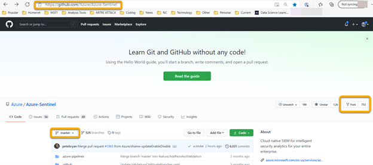
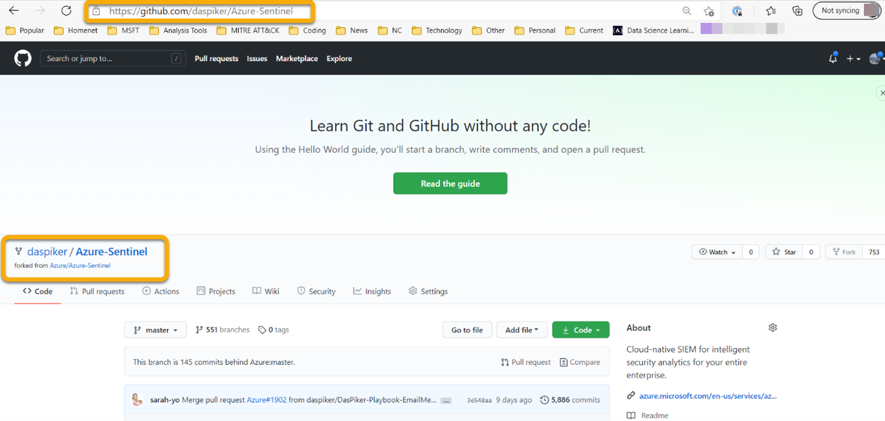

# Azure Sentinel Community

**How to get started contributing**

Disclaimer: There are lots of ways to do this.  This document describes how to use Visual Studio Code (VS Code) blended with some command line Git. You can do everything just within VS Code using built in GitHub extensions.  Many people code in whatever platform and use GitHub Desktop to handle all the Git parts of the process. 

**GitHub account**: 

Get a GitHub account – ([www.github.com](http://www.github.com) ) - Free account works fine.

Login

**Fork the Repository**:

Go to the community page: https://github.com/Azure/Azure-Sentinel

Make sure you are on the master branch

Click Fork

This will create a copy of the Azure-Sentinel repository in your own GitHub account:

**Clone the fork to your local machine**:

Create a directory on your local machine where you will pull down the repository to and where you will be working from. In my case it is C:\Users\\(username)\Documents\GitForks

Cd into that directory

Run : Git init

Run : Git clone <url of your fork> example: Git clone “https://github.com/(username)/Azure-Sentinel”

Cd into the new directory that is created ie cd Azure-Sentinel

You now need to set the upstream which is the original repo that you forked from ie the Sentinel community repo

Run : Git remote add upstream https://github.com/Azure/Azure-Sentinel

Run : Git remote -v

And you should see something like this:

PS C:\Users\(username)\Documents\GitForks\Azure-Sentinel> git remote -v

origin https://github.com/(username)/Azure-Sentinel.git (fetch)

origin https://github.com/(username)/Azure-Sentinel.git (push)

upstream    https://github.com/Azure/Azure-Sentinel.git (fetch)

upstream    https://github.com/Azure/Azure-Sentinel.git (push)

**Create a branch:**

You can work with the local master but it is recommended to work with a branch so if you have separate projects you are working on you can keep them isolated.

First you want to sync your local repository to the upstream master (the Azure community itself – not your fork)

Run : git pull upstream master

You should see a list of updates that are processed or a message saying you are up to date

Now that you are in sync create your new branch

Run : Git checkout -b <branch name> Ex Git checkout -b MyNewContribution

**Install VS Code:**

[[Download Visual Studio Code - Mac, Linux, Windows](https://code.visualstudio.com/Download)]

**Open Branch in VS Code:**

Run VS Code and then File > Open Folder the local repository directory (for me it is C:\Users\\(username)\Documents\GitForks\Azure-Sentinel)

You should see all the directories and files in the repository and at the bottom you can see which branch you are working on.