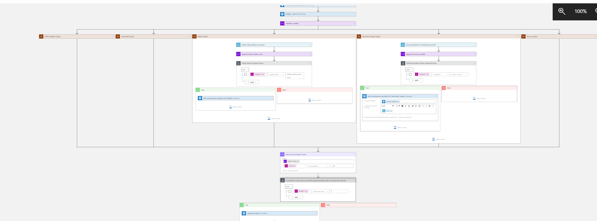
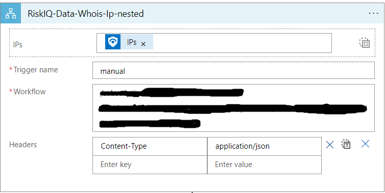
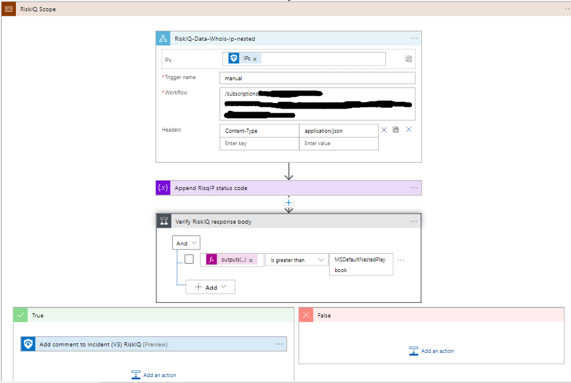

# Master Playbook IP Enrichment 

Master playbook is integrated with multiple end products like GeoIP ,HYAS Insights, Recorded Future, RisqIQ and Virus Total.

Firewall end products are deployed as child/nested playbooks.

If a malicious IP is detected from the Azure sentinel, master playbook calls all the child/nested playbooks and each product will take steps needed on that Ip Address and comments will be passed on the master playbook from the child/nested playbooks involving multiple products. 

## Summary
 When a new Azure Sentinel incident is created, this playbook gets triggered and performs the below actions:
 1. Fetches a list of potentially malicious IP addresses.
 2. Each nested playbook receives the list of IP addresses and performs respective defined automated actions on it.
 3. Response from individual playbooks are returned to master playbook for incident comment. 

 ## Pre-requisites for deployment
At least one of the below-mentioned nested playbooks must be deployed prior to deployment of this playbook under same subscription and same resource group and the same location/region. Capture the name of all the deployed playbooks during deployment.

- [GeoIP-IP-Enrichment-Nested](./GeoIP-IP-Enrichment/azuredeploy.json) is a nested playbook that handles enrichment for GeoIP.  
- [HYAS_Insights-IP-Enrichment](./HYAS_Insights-IP-Enrichment/azuredeploy.json) is a nested playbook that handles enrichment for HYAS Insights. 
- [RecordedFuture-IP-Enrichment](./RecordedFuture-IP-Enrichment/azuredeploy.json) is a nested playbook that handles enrichment for Recorded Future. 
- [RiskIQ-IP-Enrichment](./RiskIQ-IP-Enrichment/azuredeploy.json) is a nested playbook that handles enrichment for RiskIQ. 
- [VirusTotal-IP-Enrichment](./VirusTotal-IP-Enrichment/azuredeploy.json) is a nested playbook that handles enrichment for VirusTotal. 

If any one of the above-mentioned playbooks are not deployed then default playbook will deploy in its place.

## Nested Playbook Structure

### Input Schema

Each of the nested playbooks of IP Remediation accepts following inputs:
- IPs: List of IPs as entities from azure sentinel incident.
- Workflow: Worklfow is identifier for the nested playbook which points to which subscription and which resource group the nested playbook belongs to.
- Trigger: Tells how the playbook is invoked/triggered.
- Headers: Tells the content type of entity accepting by nested playbook.

The image below shows example of input schema for CiscoMeraki nested playbook.

### Output Schema

Each of the nested playbooks of IP Enrichment gives following outputs:

- Status code: Status code tells the success or failure status of nested playbook run results. The status code value is displayed in incident comment.
- Body: Body provides with all the output values that nested playbook returns. It varies according to the nested playbook. 
- Incident Comment: It contains output body from nested playbook in string format.

## Add new playbook to master playbook

To add new nested playbook to master playbook:
- Hover below action "Initialize variable playbook status Codes".
- Click on symbol '+' for insert a new step and choose add a parallel branch.
- First action is to add scope. Within scope add new action and choose the nested playbook to add.
- Compose Incident Comment.
- Append the status code from nested playbook to Status Codes variable .

 ## Deployment Instructions
 1. Deploy the playbook by clicking on the "Deploy to Azure" button. This will take you to deploy an ARM Template wizard.

 2. Fill in the required parameters for deploying the playbook.

 | Parameter                           | Description                                                       |
|-------------------------------------|-------------------------------------------------------------------|
| **Playbook Name**                   | Enter the master playbook name here without spaces.               |
| **Geo IP Playbook Name**            | Enter the name of Geo IP Nested playbook without spaces.          |
| **HYAS Insights Playbook Name**     | Enter the name of HYAS Insights Nested playbook without spaces.      |
| **RecordedFuture Playbook Name**    | Enter the name of RecordedFuture Nested playbook without spaces.        | 
| **RisqIQ Playbook Name**            | Enter the name of RisqIQ Nested playbook without spaces.          |
| **VirusTotal Playbook Name** | Enter the name of VirusTotal Nested playbook without spaces. |

# Post-Deployment Instructions

### Configurations in Sentinel
- In Azure sentinel analytical rules should be configured to trigger an incident with IP addresses. 
- Configure the automation rules to trigger the playbook which calls multiple nested playbooks.

# Playbook steps explained
## When Azure Sentinel incident creation rule is triggered
Captures potentially malicious or malware IP addresses incident information.

##Entities - Get IPs
Get the list of IPs as entities from the Incident.

## For malicious IP addresses received from the incident
 1. The list of IP address is passed as Entity to each of the nested playbook.
 2. Each nested playbook accepts IP list as entity from master playbook and respectively performs defined automated actions for each IP address.
 3. The response from each of the nested playbook is returned to master playbook.
 4. Response from each nested playbook is attached to incident comment and consolidated incident comment is created.
 5. If all the nested playbooks returns success response , the incident will be closed.
 