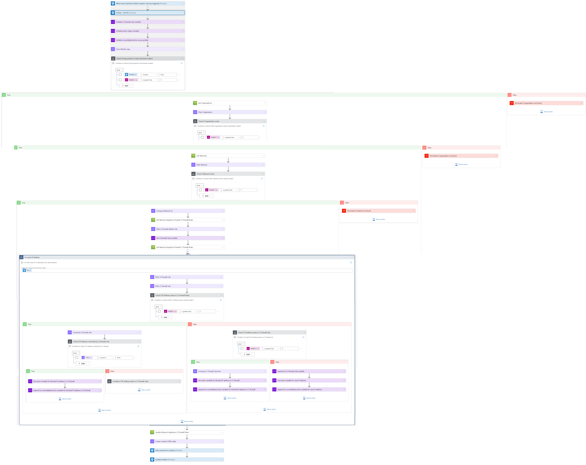
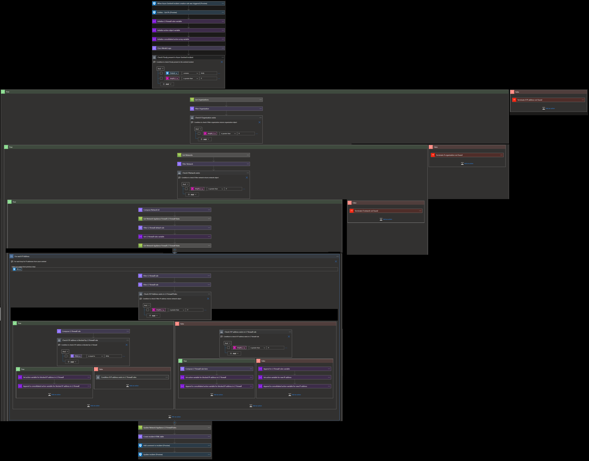
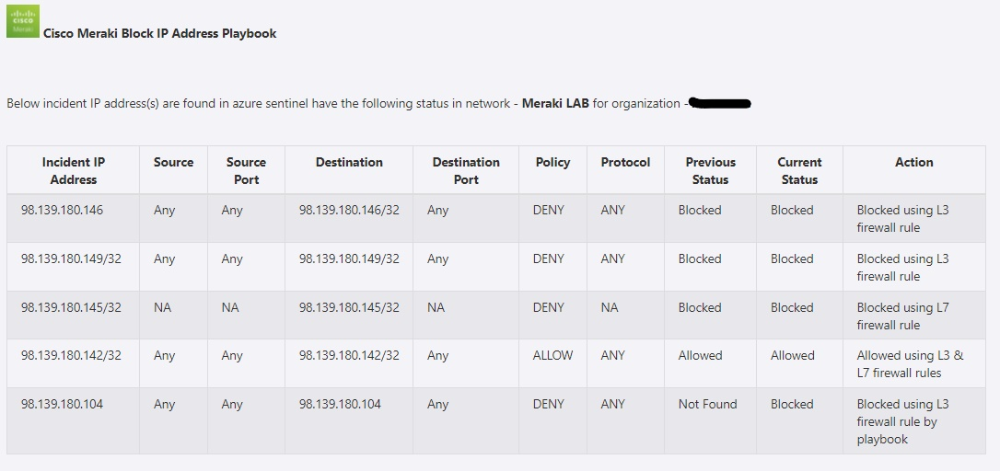
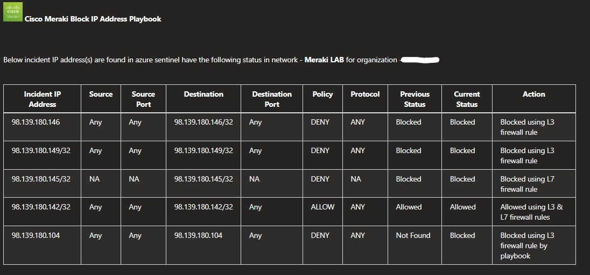

# Cisco Meraki Block IP Address Playbook

## Summary
 When a new Azure Sentinel incident is created, this playbook gets triggered and performs the below actions:
 1. Fetches a list of potentially malicious IP addresses.
 2. For each IP address in the list, checks if the IP address is blocked by L3 firewall rule or L7 firewall rule of MX network.
  - If IP address is part of both L3 firewall rule and L7 firewall rule but not blocked by either of the rules, then Incident Comment is created saying IP address allowed by firewall.
  - If IP address is part of either L3 firewall rule or L7 firewall rule and blocked by the rule, then Incident Comment is created saying IP address is blocked.
  - If IP address is not part of either L3 firewall rule or L7 firewall rule, then that IP address is blocked by playbook.
3. Update the incident with status 'Closed' and reason as
  - For allowed IP - 'BenignPositive - SuspiciousButExpected'
  - For blocked IP - 'TruePositive - SuspiciousActivity'

 ## Pre-requisites for deployment
1. Deploy the Cisco Meraki Custom Connector before the deployment of this playbook under the same subscription and same resource group. Capture the name of the connector during deployment.
2. Cisco Meraki API Key should be known to establish a connection with Cisco Meraki Custom Connector. [Refer here](https://developer.cisco.com/meraki/api-v1/#!getting-started/authorization)
3. Organization name should be known. [Refer here](https://developer.cisco.com/meraki/api-v1/#!getting-started/find-your-organization-id) 
4. Network name should be known.[Refer here](https://developer.cisco.com/meraki/api-v1/#!getting-started/find-your-network-id)

 ## Deployment Instructions
 1. Deploy the playbook by clicking on the "Deploy to Azure" button. This will take you to deploy an ARM Template wizard.

   

 2. Fill in the required parameters for deploying the playbook.

 | Parameter  | Description |
| ------------- | ------------- |
| **Playbook Name** | Enter the playbook name here without spaces |
| **Cisco Meraki Connector Name**|Enter the name of Cisco Meraki custom connector without spaces |
| **Organization Name** | Enter organization name |
| **Network Name**| Enter network name | 

# Post-Deployment Instructions 
## a. Authorize API connection
* Once deployment is complete, go under deployment details and authorize Cisco Meraki connection. 
1.  Click the Cisco Meraki connection
2.  Click **Edit API connection**
3.  Enter API Key
4.  Click Save

## b. Configurations in Sentinel
- In Azure sentinel analytical rules should be configured to trigger an incident with IP addresses. 
- Configure the automation rules to trigger the playbook.

# Playbook steps explained
## When Azure Sentinel incident creation rule is triggered
  Captures potentially malicious or malware IP addresses incident information.

## Entities - Get IPs
  Get the list of IPs as entities from the Incident.

## Compose image to add in the incident
This action will compose the Cisco Meraki image to add to the incident comments.

## Check if Organization exists
 *  If organization name exists in list of organizations associated with the account, then return organization. 
 *  If organization name does not exist, then terminate with the error that organization not found.

 ## Check if network exists
  *  If network name exists in list of networks associated with the organization, then return network associated with the organization. 
 *  If network name does not exist, then terminate with the error that network not found.

## For each malicious IP received from the incident
 - Checks if the IP address is part of L3 firewall rule or L7 firewall rule of MX network.
   - If IP address is part of both L3 firewall rule and L7 firewall rule but not blocked by either of the rules, then Incident Comment is created saying IP address allowed by firewall.
   - If IP address is part of either L3 firewall rule or L7 firewall rule and blocked by the rule, then Incident Comment is created saying IP address is blocked.
   - If IP address is not part of either L3 firewall rule or L7 firewall rule, then that IP address is blocked by playbook. Incident Comment is created saying IP address blocked by playbook.
 - Add incident Comment from all the cases.
 - Update the incident with status 'Closed' and reason as
   - For allowed IP - 'BenignPositive - SuspiciousButExpected'
   - For blocked IP - 'TruePositive - SuspiciousActivity'

## Incident comment 

