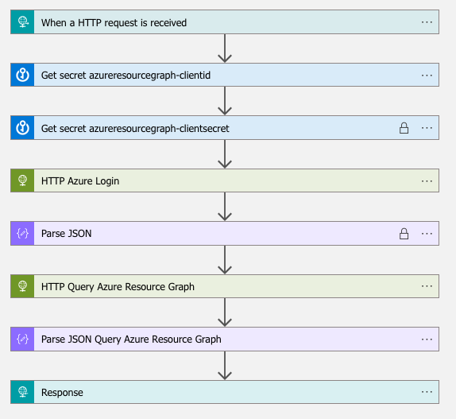

# Enrich-AzureResourceGraph

This LogicApp is querying Azure ResourceGraph and return typical azure information related to the resource like subscription, resourcegroup, tags and management groups.
It is encapsulated in other Logic app to enrich Sentinel incident (like Enrich-AzureResourceGraph-Incident).

## Quick Deployment

[Learn more about automation rules](https://docs.microsoft.com/azure/sentinel/automate-incident-handling-with-automation-rules#creating-and-managing-automation-rules)

[](https://portal.azure.com/#create/Microsoft.Template/uri/https%3A%2F%2Fraw.githubusercontent.com%2FAzure%2FAzure-Sentinel%2Fmaster%2FPlaybooks%2FEnrich-AzureResourceGraph%2Fazuredeploy.json)
[](https://portal.azure.us/#create/Microsoft.Template/uri/https%3A%2F%2Fraw.githubusercontent.com%2FAzure%2FAzure-Sentinel%2Fmaster%2FPlaybooks%2FEnrich-AzureResourceGraph%2Fazuredeploy.json)


## Prerequisites

* AzureResourceGraph data access requires Reader access for targeted scope
* Service principal client id and secret stored in Azure keyvault (Possible change to Managed Identity as supported by HTTP block)

## Screenshots


## Workflow explained
(step by step pseudo-code)

1. When a HTTP request is received
2. Get Azure ResourceGraph client id and secret from Keyvault
3. Do Azure Login
4. Do Azure ResourceGraph query
5. Return response through HTTP

Included queries (KQL, Azure ResourceGraph...
Current query is
```
resources
| where name == \"@{triggerBody()?['resourceName']}\"
| join kind=inner (
    resourcecontainers
    | where type == 'microsoft.resources/subscriptions'
    | project subscriptionId, subscriptionName = name, subproperties = properties
) on subscriptionId
| project subscriptionName, resourceGroup, name, type, tags, subproperties
```
