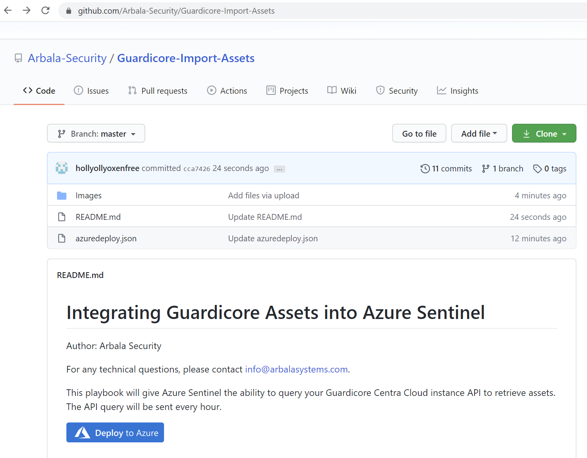
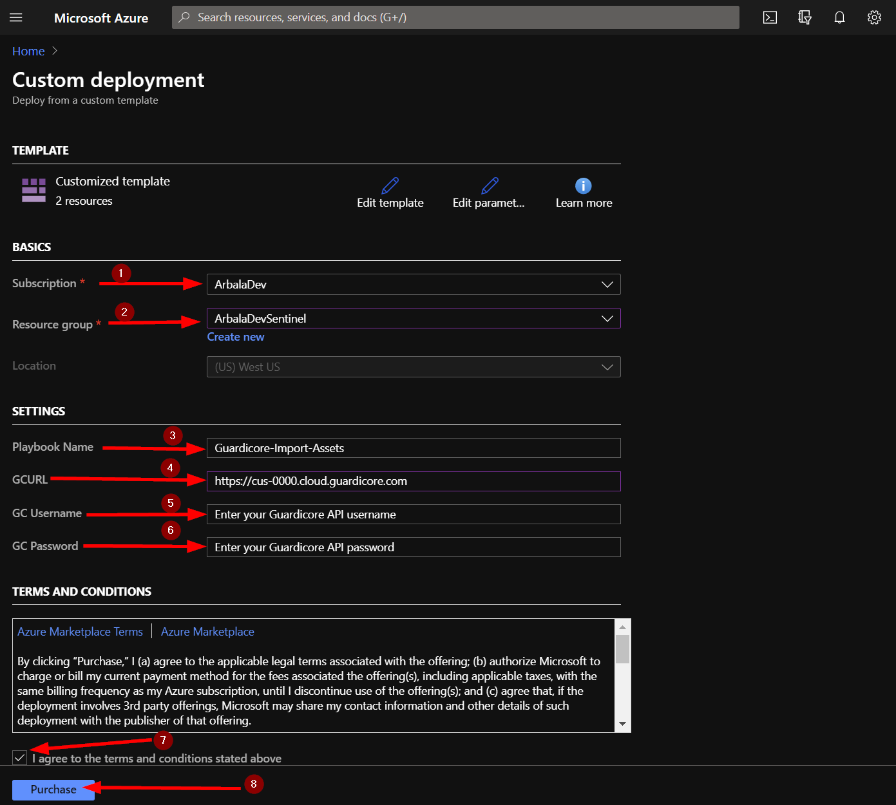
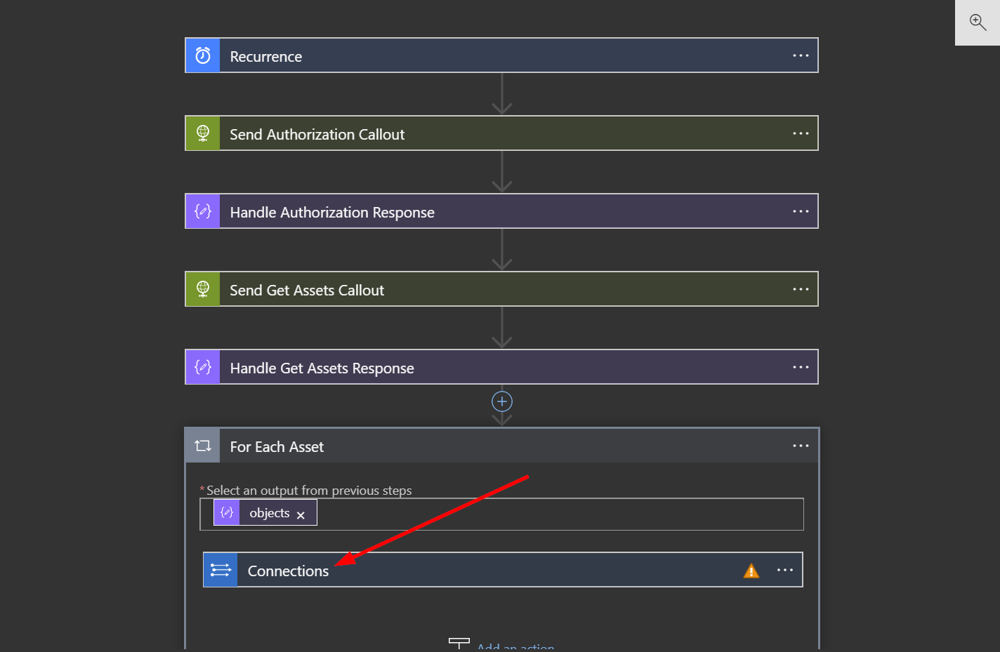
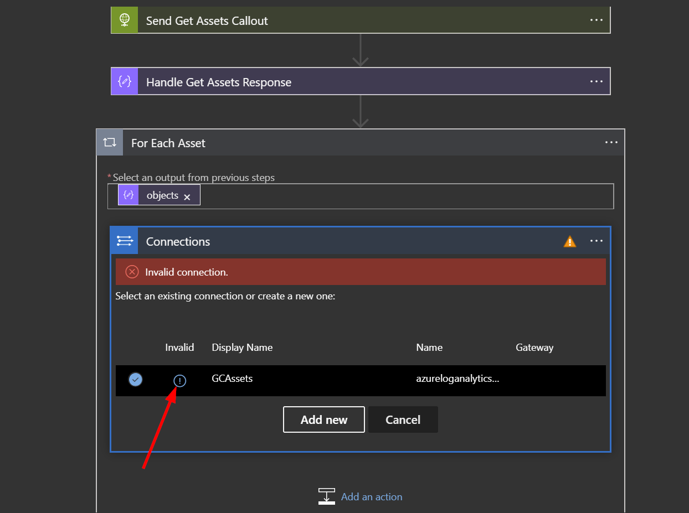
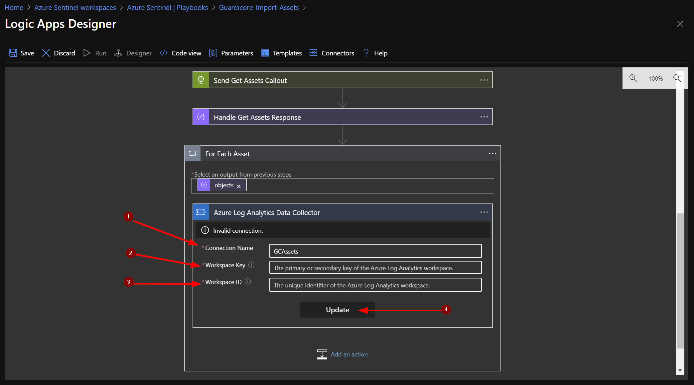
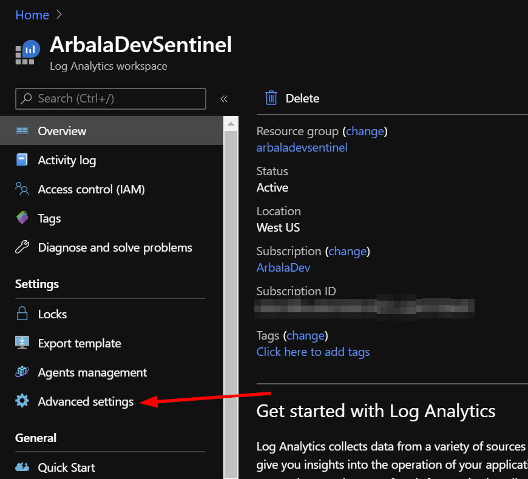
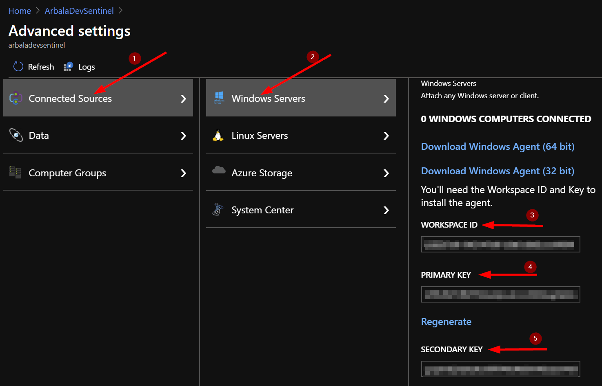

# Integrating Guardicore Assets into Azure Sentinel 

Author: Accelerynt

For any technical questions, please contact info@accelerynt.com

This playbook will give Azure Sentinel the ability to query your Guardicore Centra Cloud instance API to retrieve all installed assets. The API query will be sent every hour.

#

You will need the following items to enter in the playbook settings during deployment: 

* URL for your Guardicore instance. 

* A Username/Password that is a Local Administrator in your Guardicore environment. 

* The Azure Sentinel Workspace ID where you want the incidents logged. 

* The Primary or Secondary Key to your workspace. 

Click the “Deploy to Azure” button and this will bring you to the Custom Deployment Template.

In the **BASICS** section:  

* Select the “**Subscription**” and “**Resource Group**” from the dropdown boxes you would like the playbook deployed to.  

In the **SETTINGS** section:   

* **Playbook Name**: This can be left as “Guardicore-Import-Assets” or you may change it.  

* **GCURL**: Enter your Guardicore tenant URL here. You can replace <guardicore_instance_url> with cus-0000.cloud.guardicore, where 0000 is your 4 digit customer number or copy and paste the URL from your Guardicore instance. It must look exactly like - https://cus-0000.cloud.guardicore.com  Also, ensure there is no / after the .com. 

* **GC Username**: Replace text with username of the Guardicore Admin account you want to use. 

* **GC Password**: Replace text with password of the Guardicore Admin account you want to use. 

Towards the bottom ensure you check the box accepting the terms and conditions and then click on “Purchase”. 

The playbook should take less than a minute to deploy. Return to your Azure Sentinel workspace and click on “Playbooks.” Next, click on your newly deployed playbook. Don’t be alarmed to see that the status of the playbook shows failed. We still need to edit the playbook to enter the Azure Sentinel Workspace ID and Key.  

Click on the “Edit” button. This will bring us into the Logic Apps Designer.

Click on the bottom bar labeled “For Each Asset”. 

Click on “Connections”.  

Click on the circled exclamation point under the word "Invalid". 

In the **Connection Name** put GCAssets. The next fields are **Workspace Key** (Primary or Secondary Key) and **Workspace ID**. Follow the instructions at the bottom of this page to find those values. Once you have them, copy and paste them into their respective fields. Now click the update button.  

You should see the that the “Send Data” box has updated and displays “Connected to GCAssets.” Click the X to close the Logic App Designer. There is no need to click the save button.  

Back at your playbook overview we will want to manually run the playbook to grab the assets. Click on "Run Trigger" and the click the "Recurrance" tag that pops up below.

You should now have a table of your Guardicore assets and their properties in Sentinel. You can view the asset logs by returning to your Azure Sentinel workspace and clicking on “Logs.” You should have a new custom log called “GCAssets_CL” – type that into your query window and click run. Set the time frame for 1 hour. Each line returned contains the details for each individual asset returned from the Guardicore API. 

## Finding your Azure Sentinel Workspace ID and Primary/Secondary Key 

To find your Workspace ID and Primary/Secondary key, start by clicking on “Settings” from the Azure Sentinel workspace you want the incidents sent to. Then click on “Workspace Settings” under the Azure Search Bar. 

Click on “Advanced Settings”. 

Next, click on “Connected Sources” and then “Windows Servers” to display your Workspace ID and either Primary or Secondary key. 

