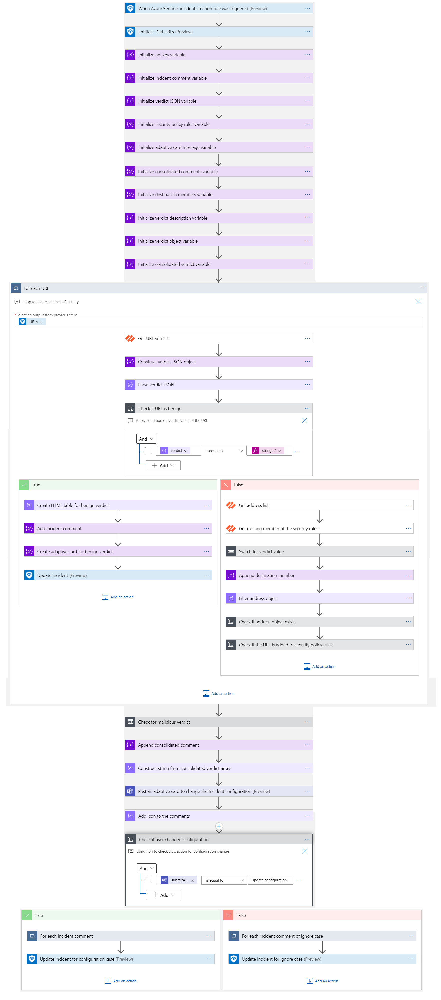
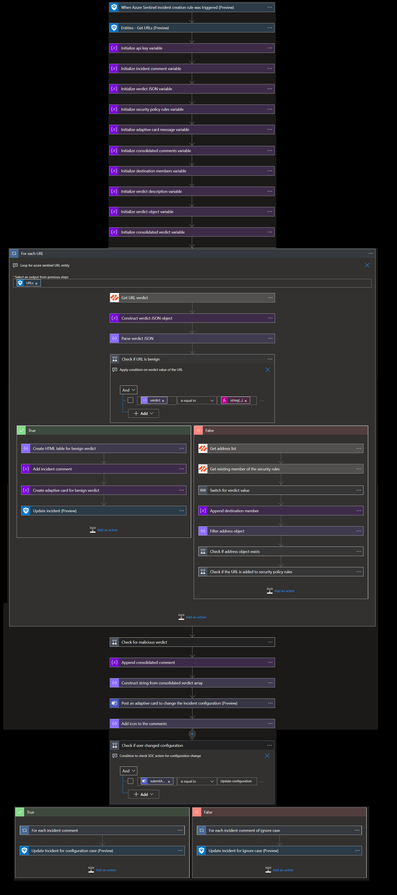
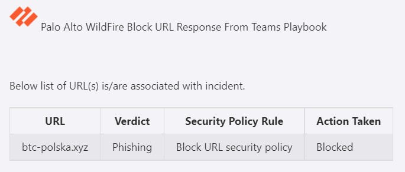
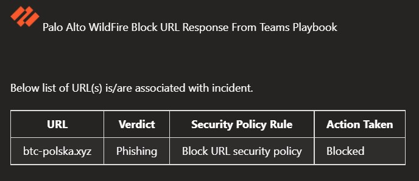
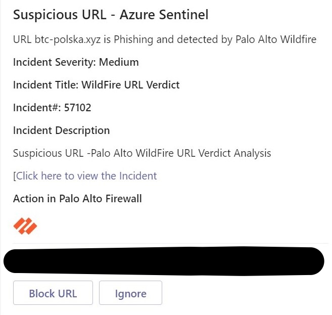
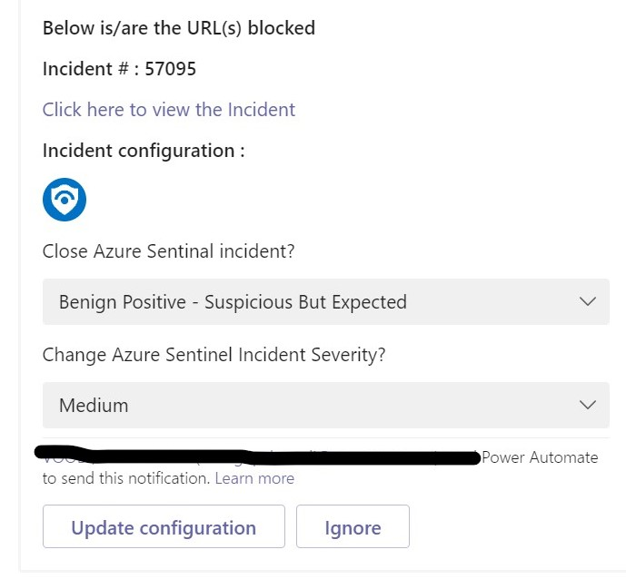

# Palo Alto Wildfire Block URL From Teams Playbook
# Summary
This playbook automates the URL verdict and adds it to security policy rules.

When a new Azure Sentinel incident is created, this playbook gets triggered and performs below actions:
- It fetches detailed verdict information of the URL.
- It checks for verdict status. If it is benign then it closes the incident with URL verdict information.
- If verdict status is other than benign (phishing, malware, grayware) then it creates the address object for URL and adds address object to the security policy rules.

**PlayBook Overview:**

# Prerequisites
- Deploy both palo alto wildfire custom connector and palo alto PAN-OS custom connector in the same resource group and same subscription as this playbook. Capture the name for both connectors during deployment.
- Generate wildfire API key to establish the connection to wildfire custom connector. [Generate Wildfire API Key](https://wildfire.paloaltonetworks.com/wildfire/dashboard)
- Spin Palo alto PAN-OS VM and Generate API key. [Generate Palo Alto PAN-OS Api Key](https://docs.paloaltonetworks.com/vm-series/9-1/vm-series-deployment/license-the-vm-series-firewall/licensing-api/manage-the-licensing-api-key.html)
- Create the security policy rule in the Palo Alto PAN-OS VM.

# Deployment instructions 
- Deploy the playbook by clicking on "Deploy to Azure" button. This will take you to deploying an ARM Template wizard.

 - Fill in the required parameters for deploying playbook.
## Deployment Parameters

| Parameter  | Description |
| ------------- | ------------- |
| **Playbook Name** | Enter the Playbook Name |
| **Wildfire API Key**  | Enter the WildFire API Key | 
| **Security Policy Rule** | Enter the Security Policy Rule which is created in PAN-OS |
| **Wildfire Custom Connector Name** | Enter the name of WildFire custom connector |
| **PAN-OS Custom Connector Name**  | Enter the name of PAN-OS custom connector|  

# Post-Deployment Instructions 
## a. Authorize connections
* Once deployment is complete, authorize each API connection.
  - Click the Wildfire API Connection resource
  - Click edit API connection
  - Provide the API Key
  - Click Save
* In Logic App designer authorize Teams channel connection as well, for playbooks posting adaptive cards.

## b. Configurations in Sentinel
- In Azure sentinel analytical rules should be configured to trigger an incident with filehash and URL. 
- Configure the automation rules to trigger the playbook.

# Playbook Steps
## When Azure Sentinel incident creation rule is triggered
  - Captures filehash details from incident information.
  ### For each-malicious URL received from the incident
  Iterates on the URL found in this incident (probably one) and performs the following:
- Fetches the verdict info by making call to wildfire connector.
- Check for verdict status (benign, phishing, malware, grayware).
- If it is verdict status is benign (code=0) then it closes the incident with URL verdict information.
- If verdict status is not benign (phishing, malware, grayware) then it sends an adaptive card to the SOC user and creates address object for URL and adds address object into security policy rule.

## Enrich Incident with verdict or verdict report details as follows
 
 
 
## Adaptive card recieved by SOC
 

## SOC user can change the Configurations of incidents
  