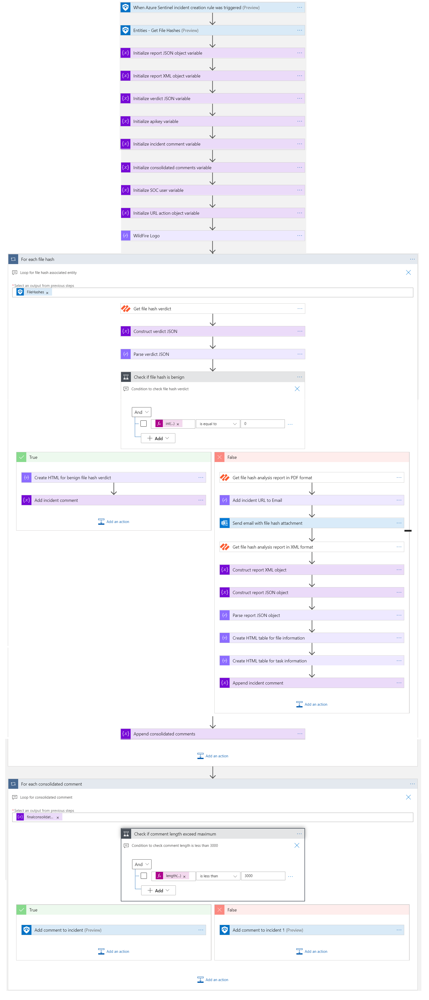
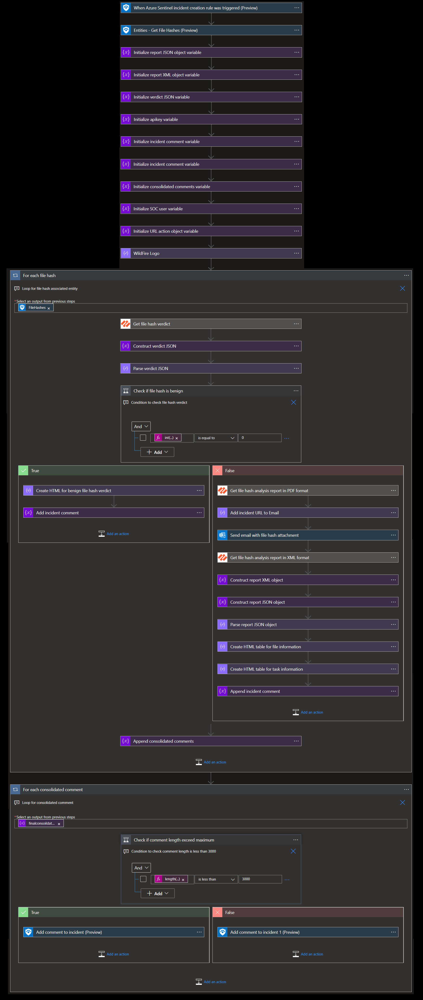
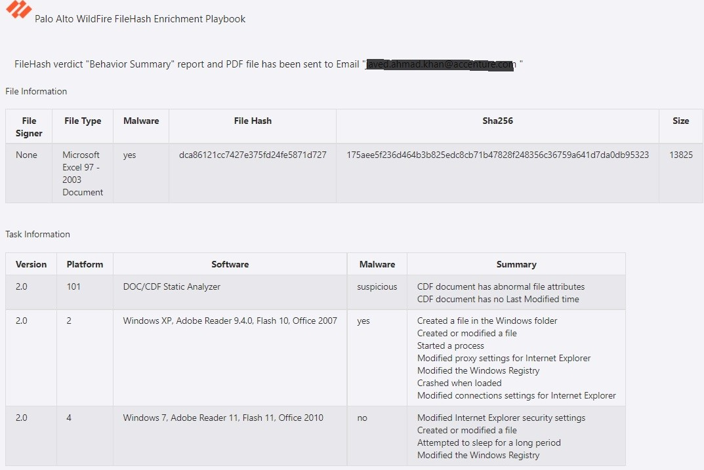
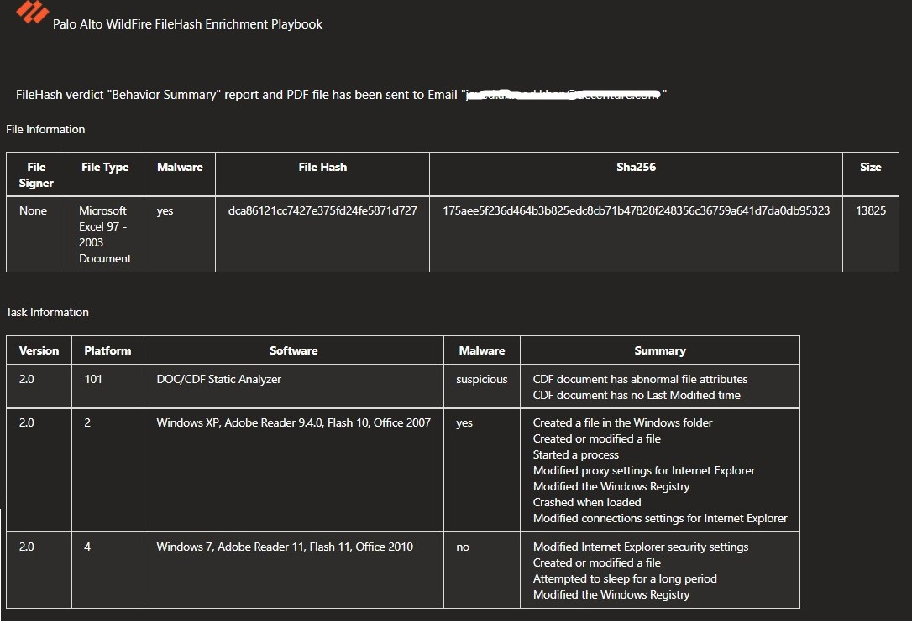
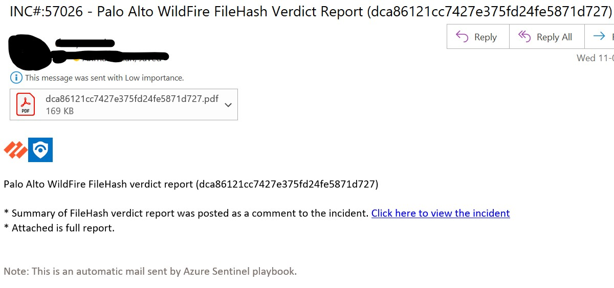

# Palo Alto Wildfire FileHash Enrichment Playbook
# Summary
This playbook enriches the incident with verdict information.

When a new Azure Sentinel incident is created, this playbook gets triggered and performs below actions:
- It fetches detailed verdict information of the file hash.
- It enriches the incident with verdict information based on the verdict values (benign, phishing, malware, grayware).

**PlayBook Overview:**

# Prerequisites 
- Palo Alto WildFire Custom Connector needs to be deployed prior to the deployment of this playbook under the same subscription and same resource group. Capture the name of connector during deployment.
- Generate wildfire API key to establish the connection to wildfire custom connector. [Generate Wildfire API Key](https://wildfire.paloaltonetworks.com/wildfire/dashboard)

# Deployment Instructions 
- Deploy the playbook by clicking on "Deploy to Azure" button. This will take you to deploying an ARM Template wizard.

- Fill in the required parameters for deploying playbook.
## Deployment Parameters

| Parameter  | Description |
| ------------- | ------------- |
| **Playbook Name** | Enter the Playbook Name|
| **Wildfire API Key**  | Enter the WildFire API Key | 
| **Wildfire Custom Connector Name** | Enter the name of WildFire custom connector |
| **Notification Email** | Enter the DL or SOC email address for receiving filehash report|

# Post-Deployment Instructions 
## a. Authorize connections
* Once deployment is complete, authorize each API connection.
  - Click the Wildfire API Connection resource
  - Click edit API connection
  - Provide the API Key
  - Click Save

## b. Configurations in Sentinel
- In Azure sentinel analytical rules should be configured to trigger an incident with filehash and URL. 
- Configure the automation rules to trigger the playbook.

# Playbook Steps
## When Azure Sentinel incident creation rule is triggered

- Captures filehash details from incident information.

 ## For each malicious file hash received from the incident
 Iterates on the filehash found in this incident (probably one) and performs the following:
- Fetches the verdict information by making call to wildfire connector.
- Check for verdict status (benign, phishing, malware, grayware).
- If verdict status is benign (code=0) then constructs HTML table with details of verdict.
- If verdict status other than benign then constructs HTML table with details of report information and the verdict report is sent to SOC via email.

# Enrich Incident with verdict or verdict report details as follows
## **When URL is having verdict status benign** 

 
 

## **When URL is having verdict status other than benign** 

 
 

## **Email received by SOC when verdict status is other than benign**

  