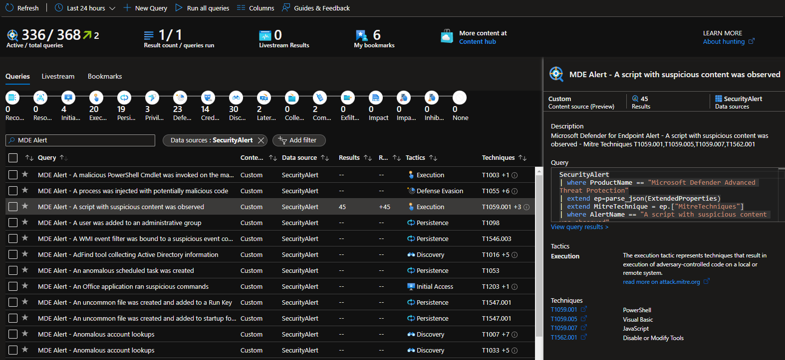
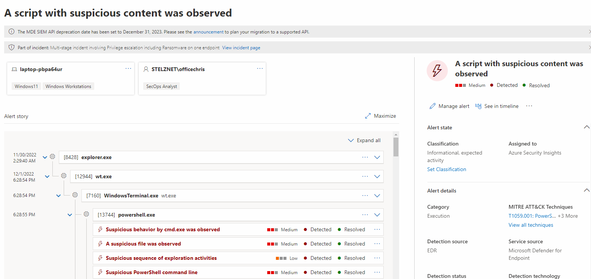
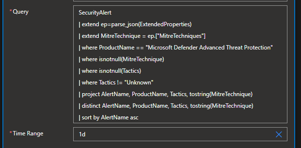

# Tutorial: Push Defender for Endpoint Alerts including Alert Names, MITRE Tactics, Techniques and Sub-Techniques as Hunting ARM Templates into a Sentinel Github Repository 

Intent: As a threat hunter or SecOps analyst, I want to be able to easily hunt for threats pertaining to certain Mitre tactics or techniques in Sentinel. 

Many of these detections are already covered under Defender for Endpoint, and it would be helpful to easily hunt for certain type of Defender for Endpoint alerts by their associated MITRE tactics, techniques and sub-techniques within the Microsoft Sentinel Hunting interface.

   
   

You can see a sample of a generated JSON ARM Hunting Template for Sentinel here - [MDE Alert JSON ARM Hunting Template](https://raw.githubusercontent.com/Azure/Azure-Sentinel/master/Playbooks/Put-MDEAlert-Hunting-GitHub/Media/MDE_A_process_was_injected_with_potentially_malicious_code_T1055_T1055_001_T1055_002_T1055_003_T1055_004_T1055_012_T1059_001.json)

## Prerequisites

You will need an existing Microsoft Sentinel workspace, connected to a GitHub repository for [Deploying Custom Content from your repository](https://learn.microsoft.com/en-us/azure/sentinel/ci-cd?tabs=github).

You will need [Defender for Endpoint alerts Syncronized to Sentinel](https://learn.microsoft.com/en-us/azure/sentinel/microsoft-365-defender-sentinel-integration) which populates the required SecurityAlerts table in Sentinel. 

You will need to generate a [Personal Access Token](https://docs.github.com/en/authentication/keeping-your-account-and-data-secure/creating-a-personal-access-token) for your Github Repository associated with Sentinel with the Repo, and Workflow permissions.

You will need your Personal Access Token from GitHub stored in Keyvault and have the URL of the secret handy.

This Logic App retrieves the GitHub Personal Access Token from Key Vault using the System Managed Identity and as such you should review and complete the steps in the article [Secure authentication for Conditional Access automation](https://github.com/Azure-Samples/azure-ad-conditional-access-apis/blob/main/00-prereq/readme.md) to create a Key Vault and connect it to a Managed Identity.

## Step 1: Deploy this logic app to your organization

If your Azure environment meets the prerequisites, and you're familiar with using Azure Resource Manager templates, these steps help you sign in directly to Azure and open the Azure Resource Manager template in the Azure portal. For more information, see the article, [Deploy resources with Azure Resource Manager templates and Azure portal](https://docs.microsoft.com/azure/azure-resource-manager/templates/overview).

Select the following image to sign in with your Azure account and open the logic app in the Azure portal:

            
   

1. In the portal, on the **Custom deployment** page, enter or select these values:

   | Property | Value | Description |
   |----------|-------|-------------|
   | **Subscription** | <*Azure-subscription-name*> | The name for the Azure subscription to use |
   | **Resource group** | <*Azure-resource-group-name*> | The name for a new or existing Azure resource group |
   | **Region** |  <*Azure-region-for-all-resources*> | The Azure region to use for all resources, if different from the default value. This example uses the default value, `[resourceGroup().location]`, which is the resource group location. |
   | **Playbook Name** | <*Put-MDEAlert-Hunting-GitHub*> | The name of the playbook to deploy.|
   | **GitHub Repo Name** | <*GitHubRepoName*> | The GitHub Repository Name that's connected to Sentinel.|
   | **GitHub Repo Owner Name** | <*GitHubRepoOwnerName*> | The GitHub Owner Name associated with the GitHub repo connected to Sentinel. |
   | **Key Vault GitHub Credentials URL** | <*KeyVaultGitHubCredentialsURL*> | The URL for your GitHub Personal Access token from Azure Key Vault|

1. When you're done, select **Review + Create** and finally **Create**.

## Step 2: Add your Logic App System Managed Identity to Key Vault with the right permissions

This logic app uses a System Managed Identity to access secrets from Key Vault. As a prerequisite you must have completed the steps in the article [Secure authentication for Conditional Access automation](https://github.com/Azure-Samples/azure-ad-conditional-access-apis/blob/main/00-prereq/readme.md) to create a Key Vault and give this Logic App's System Managed Identity the ability to Read the associated Secret at the Key Vault Git Hub Credentials URL. To learn more about how to use managed identities within Logic Apps, see the article [**Logic Apps and Managed Identities**](https://docs.microsoft.com/azure/logic-apps/create-managed-service-identity).

> [!WARNING]
> Ensure you follow best practices regarding managing secrets within Logic apps by using secure inputs and outputs as documented in the article, [Secure access and data in Azure Logic Apps]](https://docs.microsoft.com/azure/logic-apps/logic-apps-securing-a-logic-app).

## Step 3: Modify the Logic App Activity "Grab MDE Alerts with Mitre Techniques"

Modify the associated connection on the Microsoft Sentinel Activity - "Grab MDE Alerts with Mitre Techniques" to the connection with permissions to connect to your Sentinel Workspace.

You can modify the associated KQL Query to grab different alerts from Defender for Endppoint (ie. Only from your Red Team Test Machine, or Simulation Machines, All Alerts from the last 90 days, etc). The default query will retireve ALL Defender for Endpoint alerts from the past 24 hours that have an associated Tactic and Technique associated with it, it's set to do this daily.

The Logic App will grab each unique Defender for Endpoint Alert with an associated AlertName, Product Name, Tactics, MitreTechnique. Each unique instance will have an associated ARM Template generated and created in the associated Github Repository in the Hunting directory with the format.

MDE_ALERTNAME_MITRETECHNIQUES (ie. MDE_A_WMI_event_filter_was_bound_to_a_suspicious_event_consumer_T1546_003.json).

As the ARM Templates are posted they will deploy automatically into Sentinel's Hunting interface. You can see them under "Data Source = SecurityAlert", "Alert Title like MDE Alert".

If a new alert is generated from Defender for Endpoint with the same name but diffrent associated techniques, it will also be added as a unique ARM Template. This is to ensure every possible associate Mitre Technique on a Defender for Endpoint alert is available in Sentinel's Hunting interface.

If an existing ARM Template matching the same Alert Name and MITRE Technique ID's exists within the GitHub repository it will be skipped.

This will also help expand the MITRE ATT&CK Framework coverage map within Sentinel by selecting "Hunting Rules" under the "Simulated" drop down. However due to how the MITE ATT&CK Framework coverage map works within Sentinel, only ROOT techniques (ie. T1509) and not sub techniques (ie. T1059.001) will be shown, some MDE Alerts do get generated with a sub technique, but not a root technique, so keep this in mind.  

]
