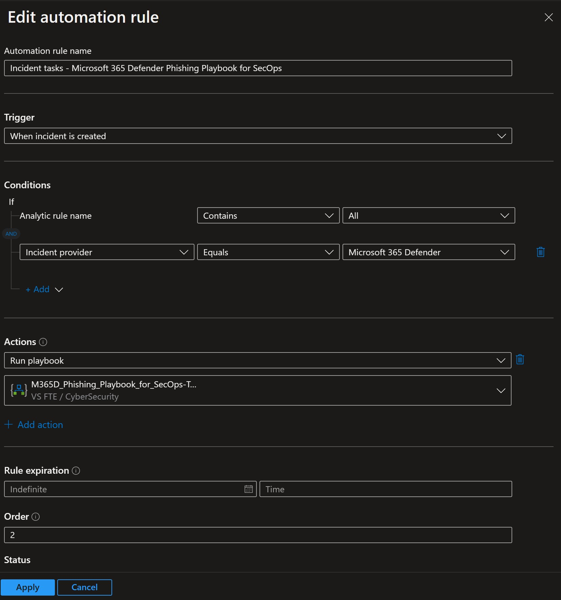

# M365D_Phishing_Playbook_for_SecOps-Tasks
author: Benji Kovacevic

This playbook add Incident Tasks based on Microsoft 365 Defender Phishing Playbook for SecOps. This playbook will walk the analyst through four stages of responding to a phishing incident: 
containment, investigation, remediation and prevention. The step-by-step instructions will help you take the required remedial action to protect information and minimize further risks.

# Quick Deployment

  

# Post-deployment
1. Assign Microsoft Sentinel Responder role to the managed identity. To do so, choose Identity blade under Settings of the Logic App.
2. Assign playbook to the automation rule. - https://learn.microsoft.com/en-us/azure/sentinel/tutorial-respond-threats-playbook?tabs=LAC 
Conditions 
    Incident provider > Equals > Microsoft 365 Defender 
     

# Screenshots

**Playbook**  
 

**Microsoft Sentinel Incident Tasks** 
