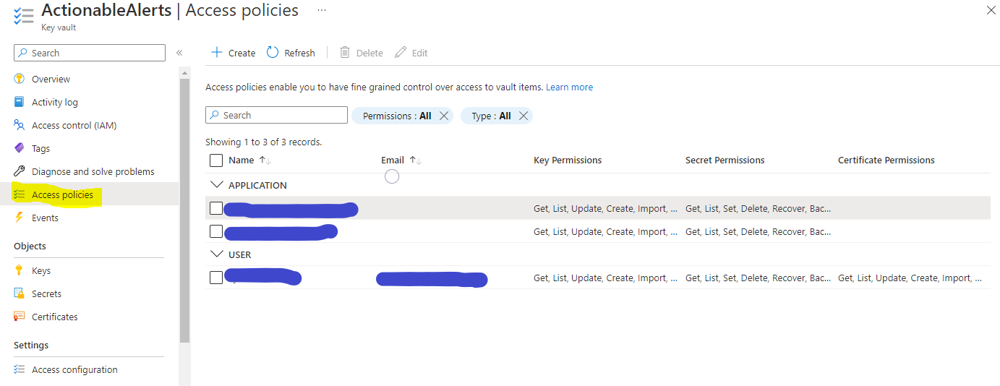
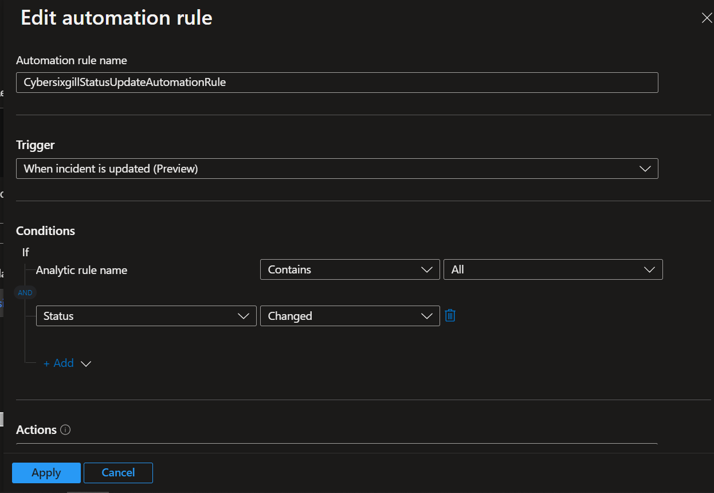
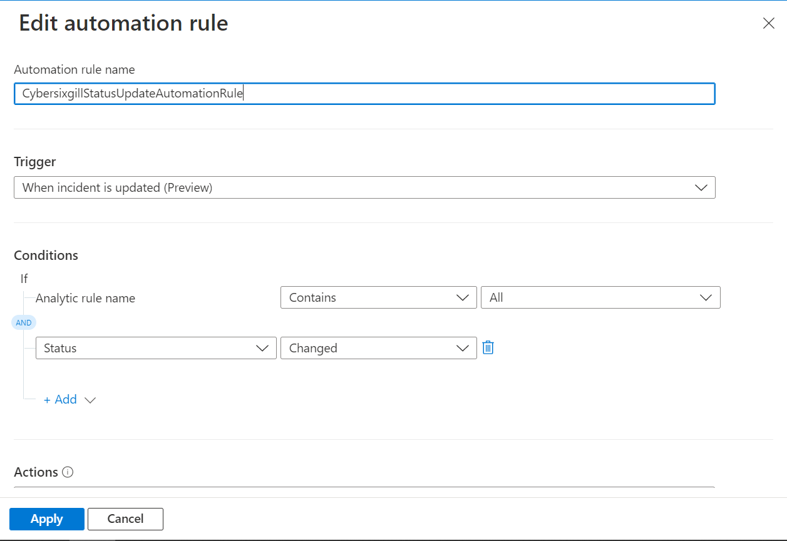

# CybersixgillAlertStatusUpdate
Author: Loginsoft

This playbook will update status of Actionable alerts in Cybersixgill Portal. When incident is updated in Microsoft Sentinel, playbook will run and update status Actionable alerts from Cybersixgill Portal 

# Prerequisites

We will need the following data to do one time setup.
1. Cybersixgill Client ID (client_id)
2. Cybersixgill Client Secret (client_secret)

Client ID and Client Secret can be obtained from [Cybersixgill Developer Portal](https://developer.cybersixgill.com/dashboard)
* You can skip below step if you already have Client ID and Client Secret.
* Visit [Cybersixgill Developer Portal](https://developer.cybersixgill.com/dashboard)
* Click on Create an application.
* Enter Application name and brief description and optional Application image
* All other fields can be left to default.
* Once done click on Create the app.
* Copy Client ID and Client Secret.

### Setup

#### Create an Azure Key Vault Secret:

Navigate to the Azure Key Vaults page: https://portal.azure.com/#view/HubsExtension/BrowseResource/resourceType/Microsoft.KeyVault%2Fvaults

Navigate to an existing Key Vault or create a new one. From the Key Vault overview page, click the "**Secrets**" menu option, found under the "**Settings**" section. Click "**Generate/Import**".

Choose a name for the secret "**clientid**", and enter the Cybersixgill Client ID copied previously in the "**Value**" field. All other settings can be left as is. Click "**Create**".
Repeat same step and create a secret for "**clientsecret**"

Once your secret has been added to the vault, navigate to the "**Access policies**" menu option, also found under the "**Settings**" section on the Key Vault page menu. Leave this page open, as you will need to return to it once the playbook has been deployed. See [Granting Access to Azure Key Vault](https://github.com/Azure/Azure-Sentinel/tree/master/Playbooks/AS-Okta-NetworkZoneUpdate#granting-access-to-azure-key-vault).

# Quick Deployment

# Post-deployment
1. Create new automation rule, ex: CybersixgillStatusUpdateAutomationRule
   * Trigger = When Incident is updated
   * Condition = Status Changed

*Automation rule example*

#
### Granting Access to Azure Key Vault

Before the Logic App can run successfully, the Key Vault connection created during deployment must be granted access to the Key Vault holding Cybersixgill Client ID and Client Secret.

From the Key Vault "**Access policies**" page, click "**Create**".

Select the "**Get**" checkbox under "**Secret permissions**", then click "**Next**".

Paste "**CybersixgillAlertStatusUpdate**" into the principal search box and click the option that appears. Click "**Next**" towards the bottom of the page.

Navigate to the "**Review + create**" section and click "**Create**".

