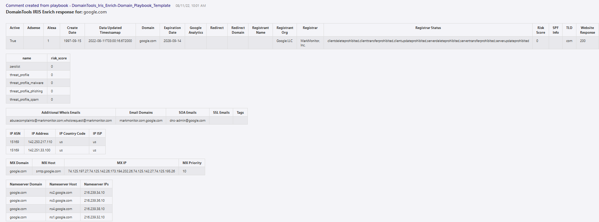

# DomainTools Iris Enrich Domain Playbook

 

## Table of Contents

1. [Overview](#overview)
1. [Deploy DomainTools Iris Enrich Domain Playbook](#deployplaybook)
1. [Authentication](#authentication)
1. [Prerequisites](#prerequisites)
1. [Deployment](#deployment)
1. [Post Deployment Steps](#postdeployment)

<a name="overview">

# Overview
This playbook uses the DomainTools Iris Enrich API, which we recommend over Iris Investigate for high-volume API lookup activities. It is able to provide domain infrastructure information for a domain or set of domains associated with an incident. If your account is provisioned for Iris Enrich, use the Iris Enrich endpoint to return Whois, mailserver, DNS, SSL and related indicators from Iris Enrich for a given domain or set of domains.
 
You can learn more about the Custom Connector via https://docs.microsoft.com/en-us/connectors/domaintoolsirisenric or visit https://www.domaintools.com/integrations to request an API key.

When a new Azure Sentinel Incident is created, this playbook gets triggered and performs the following actions:

- It fetches all the Domain objects in the Incident.
- Iterates through the Domain objects and fetches the results from DomaintTools Iris Enrich for each Domain.
- All the details from DomainTools Iris Enrich will be added as comments in a tabular format.

<a name="deployplaybook">

## Links to deploy the DomainTools Iris Enrich Domain Playbook:

 

<a name="authentication">

## Authentication
Authentication methods this connector supports:
- [API Key authentication](https://www.domaintools.com/integrations)

<a name="prerequisites">

## Prerequisites for using and deploying playbook
- A DomainTools API Key provisioned for Iris Enrich

<a name="deployment">

#### Deployment instructions
- Deploy the playbooks by clicking on "Deploy to Azure" button. This will take you to deploying an ARM Template wizard.
- Fill in the required parameters for deploying the playbook.

<a name="postdeployment">

### Post-Deployment instructions
#### a. Authorize connections
Once deployment is complete, you will need to authorize each connection:
- Click the "Azure Sentinel" connection resource
- Click "Edit API connection"
- Click "Authorize"
- Enter your DomainTools API credentials
- Click Save
- Repeat steps for other connections such as the DomainTools connector API Connection (In order to authorize the DomainTools connector API connection, an API Username and API Password need to be provided.)
- Go to the Sentinel Hook Playbook to edit Azure Sentinel rules.
#### b. Configurations in Sentinel:
- In Azure Sentinel, analytical rules should be configured to trigger an incident with with risky Domain indicators 
- Configure the automation rules to trigger the playbook
#### c. Managed Identity for Azure Sentinel Logic Apps connector:
As a best practice, we  recommend using the Sentinel connection in playbooks that use "ManagedSecurityIdentity" permissions. Please refer to [this document](https://techcommunity.microsoft.com/t5/microsoft-sentinel-blog/what-s-new-managed-identity-for-azure-sentinel-logic-apps/ba-p/2068204)
