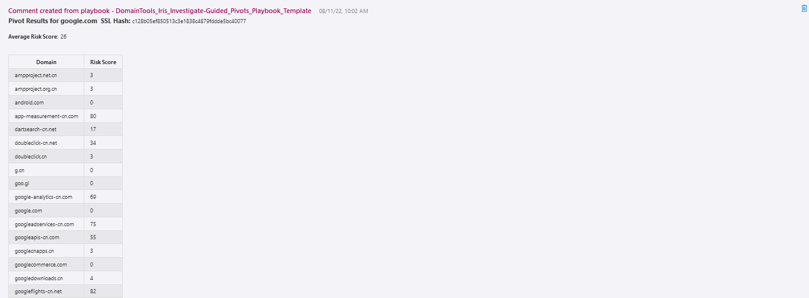

 
## DomainTools Iris Investigate Guided Pivots Playbook
## Table of Contents

1. [Overview](#overview)
1. [Deploy DomainTools Iris Investigate Guided Pivots Playbook](#deployplaybook)
1. [Authentication](#authentication)
1. [Prerequisites](#prerequisites)
1. [Deployment](#deployment)
1. [Post Deployment Steps](#postdeployment)

<a name="overview">

## Overview
This playbook uses the DomainTools Iris Investigate API. Given a domain, return whois, mailserver, DNS, SSL and related indicators from Iris Investigate, highlighting fields where < 200 domains share an attribute. This is useful in order to clue investigators where there could be additional indicators of interest available via the Iris Investigate UI or API.
 
Learn more about the Custom Connector via https://docs.microsoft.com/en-us/connectors/domaintoolsirisinves or visit https://www.domaintools.com/integrations to request an API key.

- It fetches all the Domain objects in the Incident.
- Iterates through the Domain objects and fetches the results from DomaintTools Iris Investigate for each Domain.
- It will get the details from the following actions of the Iris Investigate Custom Connector:
  - Reverse Email Domain
  - Reverese IP
  - Pivot MX Host
  - Pivot by MX IP
  - Pivot by Nameserver IP Address
  - Pivot Nameserver Host
  - Pivot by Registrant Name
  - Pivot by Registrant Org
  - Reverse Email
  - Pivot SSL Email
  - Pivot by SSL Hash

<a name="deployplaybook">

## Links to deploy the DomainTools Iris Investigate Guided Pivots Playbook

 

<a name="authentication">

## Authentication
Authentication methods this connector supports:
 - [API Key authentication](https://www.domaintools.com/integrations)

<a name="prerequisites">

## Prerequisites
- A DomainTools API Key provisioned for Iris Investigate

<a name="deployment">

### Deployment instructions
- Deploy the playbooks by clicking on "Deploy to Azure" button. This will take you to deploying an ARM Template wizard.
- Fill in the required parameters for deploying the playbook.

<a name="postdeployment">

### Post-Deployment instructions
#### a. Authorize connections: 
Once deployment is complete, you will need to authorize each connection:
- Click the "Azure Sentinel" connection resource
- Click "Edit API connection"
- Click "Authorize"
- Enter your DomainTools API credentials
- Click "Save"
- Repeat steps for other connections such as the DomainTools connector API Connection. (In order to authorize the DomainTools connector API connection, an API Username and API Password need to be provided.)
- Go to the Sentinel Hook Playbook to edit Azure Sentinel rules.
#### b. Configurations in Sentinel:
- In Azure Sentinel, analytical rules should be configured to trigger an incident with risky Domain indicators 
- Configure the automation rules to trigger the playbook
#### c. Managed Identity for Azure Sentinel Logic App connector:
As a best practice, we  recommend using the Sentinel connection in playbooks that use "ManagedSecurityIdentity" permissions. Please refer to [this document](https://techcommunity.microsoft.com/t5/microsoft-sentinel-blog/what-s-new-managed-identity-for-azure-sentinel-logic-apps/ba-p/2068204)

