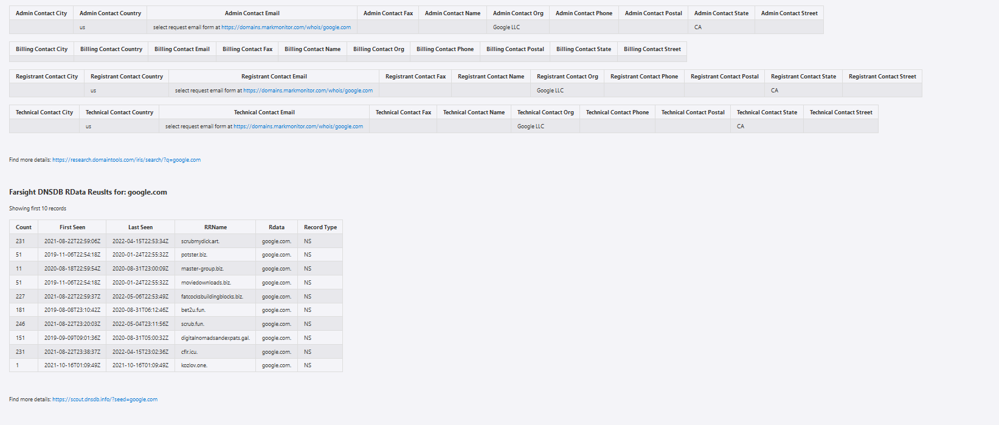
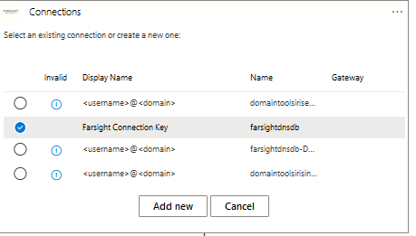

 
## DomainTools Iris Investigate With Farsight pDNS Playbook
## Table of Contents

1. [Overview](#overview)
1. [Deploy DomainTools Iris Investigate With Farsight pDNS Playbook](#deployplaybook)
1. [Authentication](#authentication)
1. [Prerequisites](#prerequisites)
1. [Deployment](#deployment)
1. [Post Deployment Steps](#postdeployment)

<a name="overview">

## Overview
This playbook uses the DomainTools Iris Investigate API and Farsight DNSDB API. Given a domain or set of domains associated with an incident, enrich the domain using the DomainTools Iris Investigate API, returning whois and infrastructure details. Subsequently retrieve associated subdomains from passive DNS information seen in Farsight’s DNSDB. DomainTools Iris Investigate and Farsight DNSDB API subscriptions are required to run this playbook.
 
Learn more about the Custom Connector via https://docs.microsoft.com/en-us/connectors/domaintoolsirisinves or visit https://www.domaintools.com/integrations to request an API key.

When a new Azure Sentinel Incident is created, this playbook gets triggered and performs these actions:

- It fetches all the Domain objects in the Incident.
- Iterates through the Domains objects and fetches the results from DomaintTools Iris Investigate and Farsight DNSDB for each Domain.
- All the details from DomainTools Iris Investigate and Farsight DNSDB will be added as comments in a tabular format.

<a name="deployplaybook">

## Links to deploy the DomainTools Iris Investigate With Farsight pDNS Playbook

 

<a name="authentication">

## Authentication
Authentication methods this connector supports
 - [API Key authentication](https://www.domaintools.com/integrations)

<a name="prerequisites">

## Prerequisites
- A DomainTools API Key provisioned for Iris Investigate.
- A Farsight DNSDB API Key.

<a name="deployment">

### Deployment instructions
- Deploy the playbooks by clicking on "Deploy to Azure" button. This will take you to deploying an ARM Template wizard.
- Fill in the required parameters for deploying the playbook.
  
- Click "Review + create". Once the validation is successful, click on "Create".  

<a name="postdeployment">

### Post-Deployment instructions
#### a. Authorize connections: 
Once deployment is complete, you will need to authorize each connection:
- Open the Logic App in the edit mode.
- Open "For each Host" Action.
- Provide connection details for the DomainTools Iris Investigate Custom Connector (A DomainTools API Username and API Key need to be provided).

 
  
- Click on "Add New", provide a name for the connection, enter your DomainTools Investigate API Username and API Key.
- Click "Create".
- Repeat these steps for any other DomainTools Iris Investigate Custom Connector connections and select the connection details created above.
  
- Open "Check if results exists" Action.
- Provide connection details for the Farsight DNSDB Custom Connector (A Farsight DNSDB API Key needs to be provided).
 
 
  
- Click on "Add New", provide a name for the connection, enter your Farsight DNSDB API Key.
- Click "Create".
- Repeat these steps for any other Farsight DNSDB Custom Connector connections and select the connection details created above.
  
- Save the Logic App. If the Logic App prompts any missing connections, please update the connections similarly.
- As a best practice, we have used the Sentinel connection in Logic Apps that use "ManagedSecurityIdentity" permissions. Please refer to [this document](https://techcommunity.microsoft.com/t5/microsoft-sentinel-blog/what-s-new-managed-identity-for-azure-sentinel-logic-apps/ba-p/2068204) and provide permissions to the Logic App accordingly.
#### b. Configurations in Sentinel:
- In Azure Sentinel, analytical rules should be configured to trigger an incident with risky Domain indicators. 
- Configure the automation rules to trigger the playbook.
