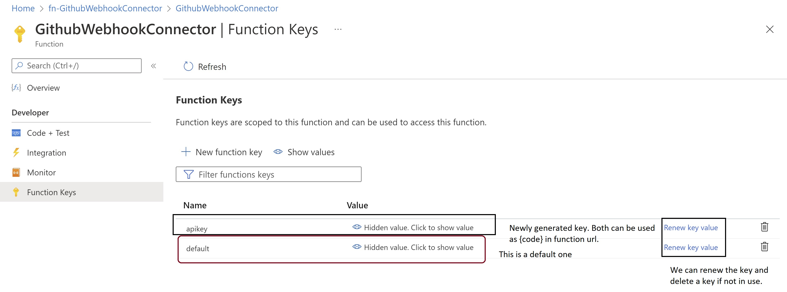

# Ingest GitHub events into sentinel
Author: Prathibha Tadikamalla

 The Azure function based github dataconnector using webhook pushes all the github events into Sentinel. All these logs will be placed into the table called "githubscanaudit_CL". As of now the solution has 3 parsers based on the below events.
  *	https://docs.github.com/en/rest/reference/code-scanning
  *	https://docs.github.com/en/rest/reference/dependabot
  *	https://docs.github.com/en/rest/reference/secret-scanning

Following are the configuration steps to deploy Function App.

## **Pre-requisites**

## Configuration Steps to Deploy Function App
1. Click on Deploy to Azure (For both Commercial & Azure GOV)  
[](https://portal.azure.com/#create/Microsoft.Template/uri/https%3A%2F%2Fraw.githubusercontent.com%2FAzure%2FAzure-Sentinel%2Fmaster%2FSolutions%2FGitHub%2FData%20Connectors%2FGithubWebhook%2Fazuredeploy_GithubWebhook_API_FunctionApp.json)
[](https://portal.azure.us/#create/Microsoft.Template/uri/https%3A%2F%2Fraw.githubusercontent.com%2FAzure%2FAzure-Sentinel%2Fmaster%2FSolutions%2FGitHub%2FData%20Connectors%2FGithubWebhook%2Fazuredeploy_GithubWebhook_API_FunctionApp.json)
  

2. Select the preferred **Subscription**, **Resource Group** and **Location**  
   **Note**  
   Best practice : Create new Resource Group while deploying - all the resources of your custom Data connector will reside in the newly created Resource 
   Group
   
3. Enter the following value in the ARM template deployment
```
"FunctionName": The name of the Azure function. Default value will be given as "fngithubwebhook"
"Workspace Id": The Sentinel Log Analytics Workspace Id  
"Workspace Key": The Sentinel Log Analytics Workspace Key  
```	
## **Post Deployment Steps**
   #### **Get the Function app endpoint**
1. Follow the below steps to get the endpoint. 
	 * Go to Azure function Overview page and go to "Functions" and click on "GithubwebhookConnector"      
         
	 * Go to "GetFunctionUrl" highlighted in the below image and copy the function url.
         
	 * You can also generate a new function key as provided in the below image and replace the {code} parameter value in the function app url.
    Ex: https://fngithubwebhookconnector.azurewebsites.net/api/GithubWebhookConnector?code={apikey}
	    

   ### **Configure Webhook to Github Organization**        
    *  Go to github and open your account and click on "Your Organizations"

       

    *  Click on Settings

       

    *  Click on "Webhooks" and configure the function app endpoint as shown below. 

       

4. With that you are done with the github configuration. After the delay of 10 to 20 mins (since LogAnalytics needs sometime to spin up the resources for the first time), you should be able to see all the transactional events from the Github into LogAnalytics workspace table called "githubscanaudit_CL" as shown below.	

    
