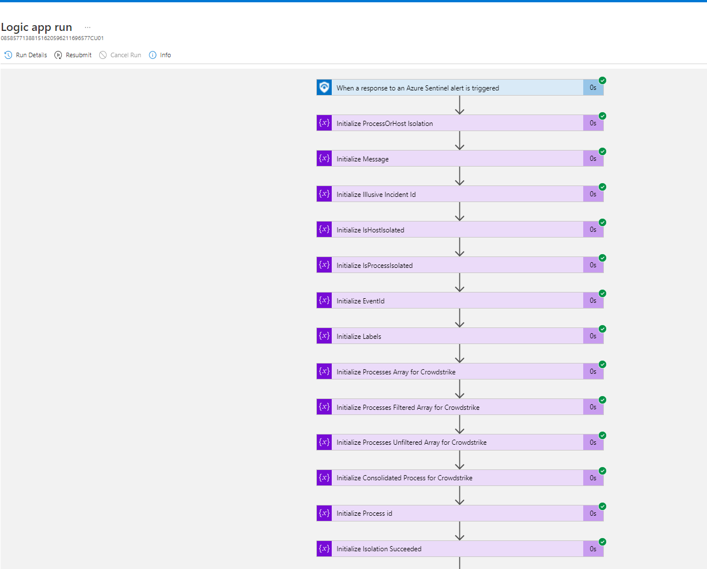
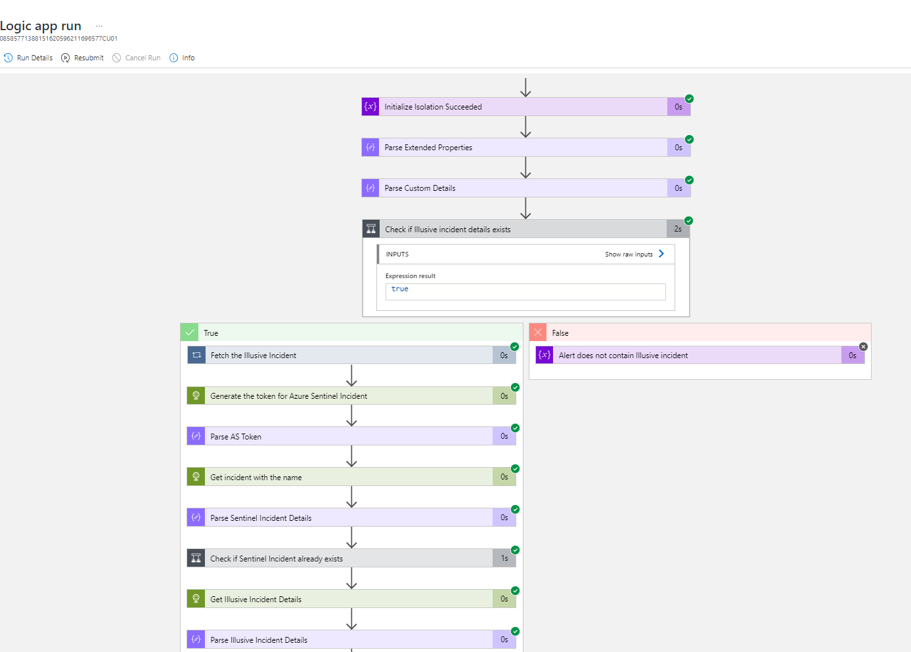
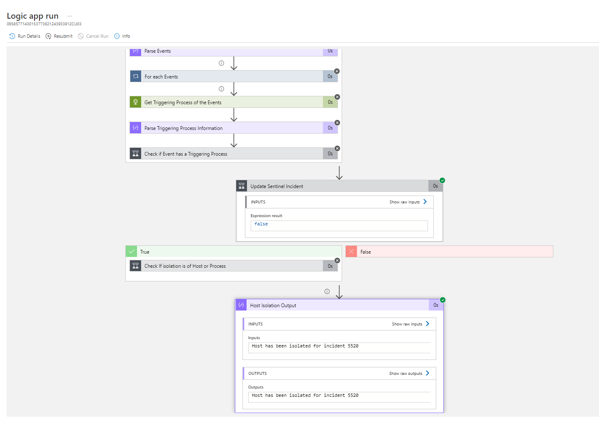

# Illusive Incident Response Playbook

## Summary

Use the playbook to quickly respond to ransomware attacks and critical incidents detected by Illusive in your organization. Upon detection, Sentinel is instructed to use the triggering process information reported by Illusive to try and stop or slow down the attack by removing or killing the process. If the triggering process cannot be killed, Sentinel is instructed to isolate the host. 
Response capabilities are available with the existence of a CrowdStrike Falcon or Microsoft Defender for Endpoint integration.

**Plabook overview:**

### Prerequisites
1. Illusive custom connector needs to be deployed prior to the deployment of this playbook, in the same resource group and region. Relevant instructions can be found in the connector doc pages.

### Deployment instructions 
1. Deploy the playbook by clicking on "Deploy to Azure" button. This will take you to deplyoing an ARM Template wizard.

2. Fill in the required paramteres:
    * Playbook Name: Enter the playbook name here (ex:IllusiveSentinelIncidentEnrichment)

### Post-Deployment instructions 
#### a. Authorize connections
Once deployment is complete, you will need to authorize each connection.
1.	Click the Azure Sentinel connection resource
2.	Click edit API connection
3.	Click Authorize
4.	Sign in
5.	Click Save
6.	Repeat steps for other connections such as Illusive (For authorizing the Illusive API connection, the username and password needs to be provided)

#### b. Configurations in Sentinel
1. In Azure sentinel analytical rules should be configured to trigger an incident with URL Entity.
2. Configure the automation rules to trigger this playbook