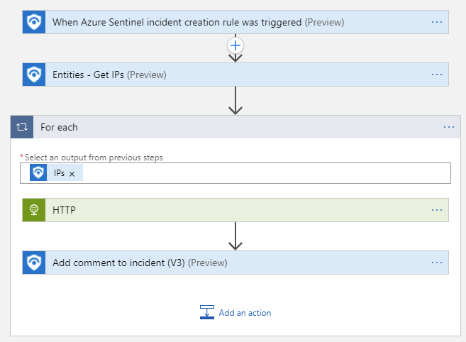
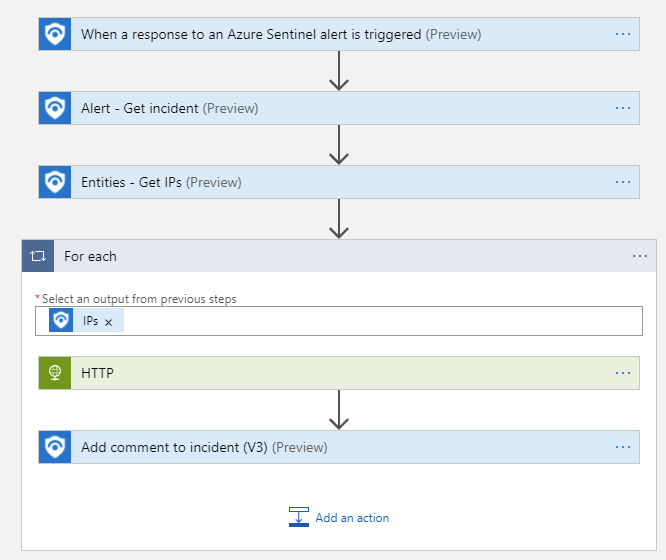
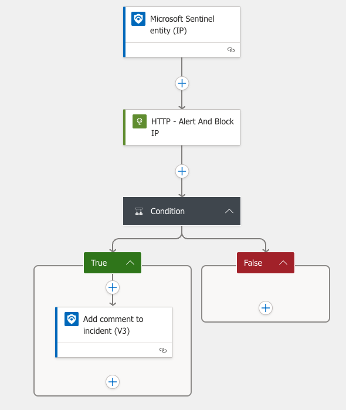
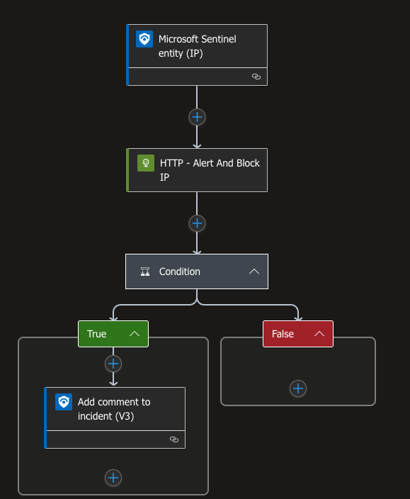

# Restrict-MDEIpAddress
authors: Nicholas DiCola, Kevin Caballero, Sarah van den Bovenkamp

This playbook will take IP entities and generate alert and block threat indicators for each IP in MDE for 90 days.

## Quick Deployment
**Deploy with incident trigger** (recommended)

After deployment, attach this playbook to an **automation rule** so it runs when the incident is created.

[Learn more about automation rules](https://docs.microsoft.com/azure/sentinel/automate-incident-handling-with-automation-rules#creating-and-managing-automation-rules)

[](https://portal.azure.com/#create/Microsoft.Template/uri/https%3A%2F%2Fraw.githubusercontent.com%2FAzure%2FAzure-Sentinel%2Fmaster%2FSolutions%2FMicrosoftDefenderForEndpoint%2FPlaybooks%2FRestrict-MDEIPAddress%2FRestrict-MDEIPAddress-incident-trigger%2Fazuredeploy.json)
[](https://portal.azure.us/#create/Microsoft.Template/uri/https%3A%2F%2Fraw.githubusercontent.com%2FAzure%2FAzure-Sentinel%2Fmaster%2FSolutions%2FMicrosoftDefenderForEndpoint%2FPlaybooks%2FRestrict-MDEIPAddress%2FRestrict-MDEIPAddress-incident-trigger%2Fazuredeploy.json)


**Deploy with alert trigger**

After deployment, you can run this playbook manually on an alert or attach it to an **analytics rule** so it will run when an alert is created.

[](https://portal.azure.com/#create/Microsoft.Template/uri/https%3A%2F%2Fraw.githubusercontent.com%2FAzure%2FAzure-Sentinel%2Fmaster%2FSolutions%2FMicrosoftDefenderForEndpoint%2FPlaybooks%2FRestrict-MDEIPAddress%2FRestrict-MDEIPAddress-alert-trigger%2Fazuredeploy.json)
[](https://portal.azure.us/#create/Microsoft.Template/uri/https%3A%2F%2Fraw.githubusercontent.com%2FAzure%2FAzure-Sentinel%2Fmaster%2FSolutions%2FMicrosoftDefenderForEndpoint%2FPlaybooks%2FRestrict-MDEIPAddress%2FRestrict-MDEIPAddress-alert-trigger%2Fazuredeploy.json)


**Deploy with entity trigger**

After deployment, you can run this playbook manually on any Sentinel incident with an IP entity in it. This will also allow you to restrict only specific IPs within an incident, rather than restricting all IPs associated with an incident.

[](https://portal.azure.com/#create/Microsoft.Template/uri/https%3A%2F%2Fraw.githubusercontent.com%2FAzure%2FAzure-Sentinel%2Fmaster%2FSolutions%2FMicrosoftDefenderForEndpoint%2FPlaybooks%2FRestrict-MDEIPAddress%2FRestrict-MDEIPAddress-entity-trigger%2Fazuredeploy.json)
[](https://portal.azure.us/#create/Microsoft.Template/uri/https%3A%2F%2Fraw.githubusercontent.com%2FAzure%2FAzure-Sentinel%2Fmaster%2FSolutions%2FMicrosoftDefenderForEndpoint%2FPlaybooks%2FRestrict-MDEIPAddress%2FRestrict-MDEIPAddress-entity-trigger%2Fazuredeploy.json)


## Prerequisites
- **For Gov Only** You will need to update the HTTP action URL to the correct URL documented [here](https://docs.microsoft.com/microsoft-365/security/defender-endpoint/gov?view=o365-worldwide#api)
- You will need to grant Ti.ReadWrite permissions and assign Microsoft Sentinel Reader to the resource group for the managed identity.  Run the following code replacing the managed identity object id, subscriptionid and resource group.  You find the managed identity object id on the Identity blade under Settings for the Logic App.
```powershell

$MIGuid = "<Enter your managed identity guid here>"
$SubscriptionId = "<Enter your subsciption id here>"
$ResourceGroup = "<Enter your resource group here>"
$MI = Get-AzureADServicePrincipal -ObjectId $MIGuid

$MDEAppId = "fc780465-2017-40d4-a0c5-307022471b92"
$PermissionName = "Ti.ReadWrite" 
$RoleName = "Microsoft Sentinel Responder"

$MDEServicePrincipal = Get-AzureADServicePrincipal -Filter "appId eq '$MDEAppId'"
$AppRole = $MDEServicePrincipal.AppRoles | Where-Object {$_.Value -eq $PermissionName -and $_.AllowedMemberTypes -contains "Application"}
New-AzureAdServiceAppRoleAssignment -ObjectId $MI.ObjectId -PrincipalId $MI.ObjectId `
-ResourceId $MDEServicePrincipal.ObjectId -Id $AppRole.Id

New-AzRoleAssignment -ObjectId $MIGuid -RoleDefinitionName $RoleName -Scope /subscriptions/$SubscriptionId/resourcegroups/$ResourceGroup
```

## Screenshots
**Incident Trigger**


**Alert Trigger**


**Entity Trigger**

