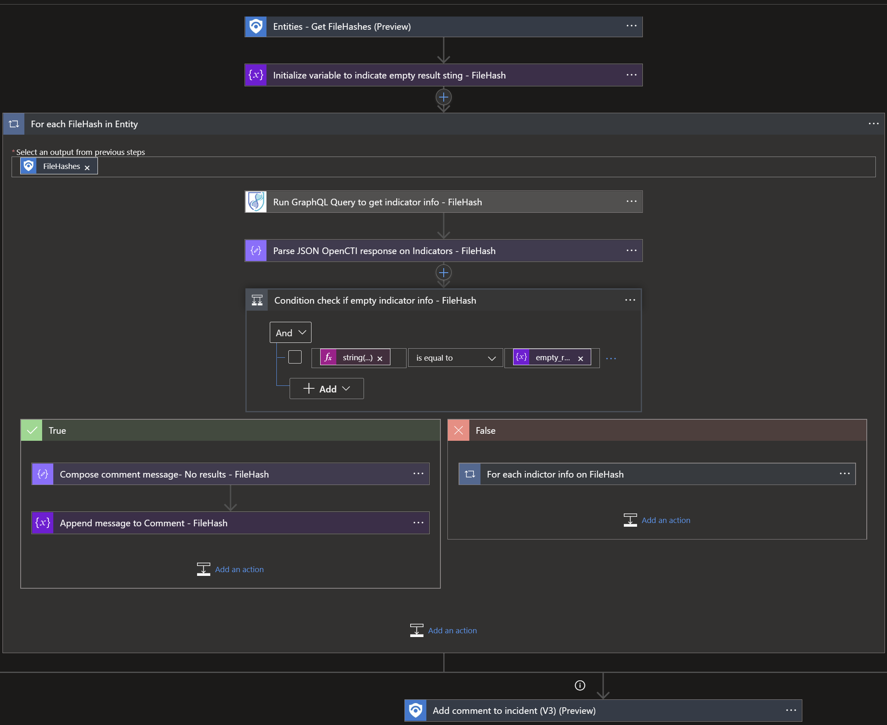

# OpenCTI-Enrich Incident With OpenCTI Indicators Info Playbook
 ## Summary
 When a new Azure Sentinel incident is created, this playbook gets triggered and performs below actions
 1. Fetches the matching indicator info of Entities (Accounts, Host, IP Address, FileHash, URL) from OpenCTI 
 2. Adds a rich comment to the incident with all the collected information
    

 

### Prerequisites 
1. OpenCTI Custom Connector needs to be deployed prior to the deployment of this playbook under the same subscription.
2. API key. To get API Key, login into your OpenCTI instance dashboard and navigate to User profile page --> API Access.

### Deployment instructions 
1. Deploy the playbook by clicking on "Deploy to Azure" button. This will take you to deplyoing an ARM Template wizard.

2. Fill in the required paramteres:
    * Playbook Name: Enter the playbook name here (Ex: OpenCTI-GetIndicatorInfo)
    * Custom Connector Name: Enter the OpenCTI custom connector name here (Ex: OpenCTICustomConnector)
    
### Post-Deployment instructions 
#### a. Authorize connections
Once deployment is complete, you will need to authorize each connection.
1.	Click the Azure Sentinel connection resource
2.	Click edit API connection
3.	Click Authorize
4.	Sign in
5.	Click Save
6.	Repeat steps for Okta Api  Connection (For authorizing the Okta API connection, API Key needs to be provided)
#### b. Configurations in Sentinel
1. In Azure sentinel analytical rules should be configured to trigger an incident with risky user account or host or URL or FileHash or IP Address. 
2. Configure the automation rules to trigger this playbook

