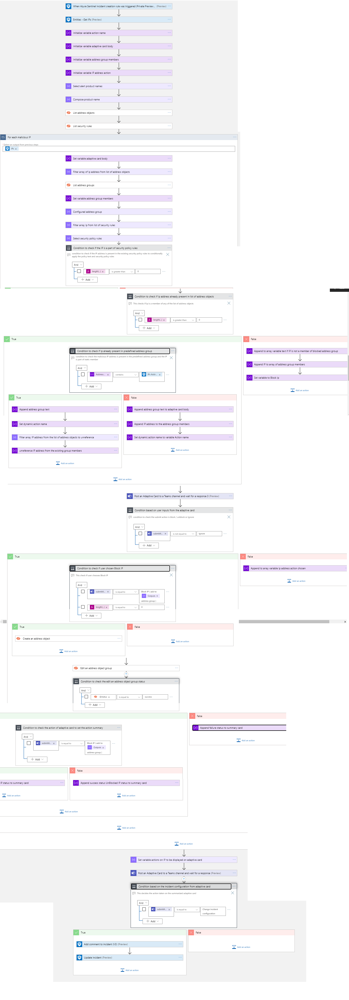
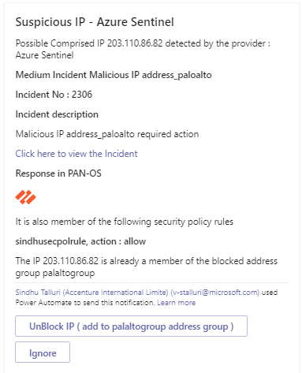
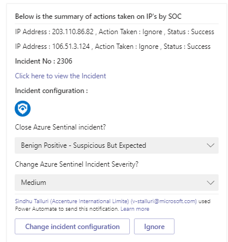

# PaloAlto-PAN-OS-BlockIP

 ## Summary

This playbook allows blocking/unblocking IPs in PaloAlto, using **Address Object Groups**. This allows to make changes on predefined address group, which is attached to predefined security policy rule.

When a new Sentinel incident is created, this playbook gets triggered and performs below actions:

1. An adaptive card is sent to the SOC channel providing Incident information, IP address, list of existing security policy rules in which IP is a member of and provides an option to Block/Unblock IP Address to predefined address group or Ignore.

2. The SOC can take action on risky IP based on the information provided in the adaptive card.

 

**This is the adaptive card SOC will receive when playbook is triggered for each risky IP for taking actions like block/unblock/ignore:**  
 

**This is the consolidate adaptive card about the summary of actions taken on IP and the incident configuration:**  
 

### Prerequisites 
1. PaloAlto connector needs to be deployed prior to the deployment of this playbook under the same subscription. Relevant instructions can be found in the connector doc page.
2. Generate an API key. [Refer this link on how to generate the API Key](https://docs.paloaltonetworks.com/pan-os/10-1/pan-os-panorama-api/get-started-with-the-pan-os-xml-api/get-your-api-key)
3. Address group should be created for PAN-OS and this should be used while creating playbooks. 

### Deployment instructions 
1. Deploy the playbook by clicking on "Deploy to Azure" button. This will take you to deploying an ARM Template wizard.

   

2. Fill in the required parameters:
    * Playbook Name: Enter the playbook name here (e.g. PaloAlto-PAN-OS-BlockIP)
    * Teams GroupId: Enter the Teams channel id to send the adaptive card
    * Teams ChannelId: Enter the Teams Group id to send the adaptive card
     [Refer the below link to get the channel id and group id](https://docs.microsoft.com/powershell/module/teams/get-teamchannel?view=teams-ps)
    * Predefined address group name: Enter the predefined address group name here to Block IP / Unblock IP
	* CustomConnectorName : Name of the custom connector, if you want to change the default name, make sure to use the same in all PaloAlto automation playbooks as well
    

### Post-Deployment instructions 
#### a. Authorize connections
Once deployment is complete, you will need to authorize each connection.
1.	Click the Microsoft Sentinel connection resource
2.	Click edit API connection
3.	Click Authorize
4.	Sign in
5.	Click Save
6.	Repeat steps for other connection such as Teams connection and PAN-OS API connection (For authorizing the PAN-OS API connection, API Key needs to be provided)

#### b. Configurations in Sentinel
1. In Microsoft sentinel analytical rules should be configured to trigger an incident with risky IP
2. Configure the automation rules to trigger this playbook

#### c. Assign Playbook Microsoft Sentinel Responder Role
1. Select the Playbook (Logic App) resource
2. Click on Identity Blade
3. Choose System assigned tab
4. Click on Azure role assignments
5. Click on Add role assignments
6. Select Scope - Resource group
7. Select Subscription - where Playbook has been created
8. Select Resource group - where Playbook has been created
9. Select Role - Microsoft Sentinel Responder
10. Click Save (It takes 3-5 minutes to show the added role.)

## Playbook steps explained

### When Microsoft Sentinel incident creation rule is triggered

Microsoft Sentinel incident is created. The playbook receives the incident as the input.

### Get Entities as IPs

Get the list of risky/malicious IPs as entities from the Incident.

### Initialize variables 

   a. Action Name (type-String) - To determine the action name to be displayed in the adaptive card such as Block or Unblock IP from predefined address group.

   b. Adaptive card body(type-Array) - To determine the dynamic adaptive card body 
   
   c. Address group Members(type-Array) - To determine the body of predefined address group
   
   d. IP Address Action(type-Array) - Consolidated actions summary on each IP to display in adaptive card

### Select alert product names

Select the first alert product name from the operators list

###Compose product name
Composes product name to be displayed on the adaptive card

### Lists all address objects 
Lists all the address objects present in the firewall

### Lists all security rules
Lists all the security policy rules present in the firewall

### For each-malicious IP received from the incident
Iterates on the IPs found in this incident (probably one) and performs the following:

#### Sets variable for text in the Adaptive card body to send to SOC 
In this step we set the variable with the incident details

#### Filter array of IP address from list of address objects
This filters the list of address objects in which IP is a member

#### Lists all address object groups
Lists all the address object groups present in the firewall

#### Sets variable address group members
This assign list of address group members

#### Compose configured address group
This composes predefined address group

### Filter array IP from list of security rules
Filter array list of security rules in which IP is a member

### Select security policy rules
Select security policy rules to display in the adaptive card

### Condition to check if the IP is a member of security policy rules
 
a) If IP is a member of security policy rules

 i) set dynamic policy text based on security policies to display in the adaptive card

 ii) set variable security policy rules to display in the adaptive card

b) If IP is not a member of any security policy rules

 i) set dynamic policy text based on security policies to display in the adaptive card

 ii) set variable security policy rules to empty to display in the adaptive card

#### Condition to check if IP address already present in list of address objects

This checks if IP is a member of any of the list of address objects

#### If IP is member of address object
  
#### Condition to check if IP is a member of predefined address group

a)If IP is a member of predefined address group

 i) Append address group text to adaptive card dynamically

 ii) Set dynamic action name dynamically (unblock IP from predefined address group)

 iii) Filter array IP address from the list of address objects to unreference IP address from the existing group members

 iv) unreference IP address from the existing group members

b)If Ip is not a member of predefined address group

 i) Append address group text to adaptive card dynamically

 ii) Append IP address to the address group members

 iii) Set dynamic action name dynamically (Block IP from predefined address group)
       
#### If IP is not member of address object

 a. Append to array variable text if IP is not a member of blocked address group

 b. Append IP to array of address group members
 
 c. Set variable to Block IP
 
#### Post an Adaptive Card to a Teams channel and wait for a response 

This posts an adaptive card to the SOC where the SOC can take action on IP like block/unblock IP based on the incident details on the adaptive card

#### Condition based on user inputs from the adaptive card

a. If Ignore-capture the action taken on IP address to display on consolidated adaptive card

b. If not Ignored

 i) capture the action taken on IP address to display on consolidated adaptive card

 ii) check if SOC choosed Block Ip and no address object is present for that IP

 if SOC chooses block IP and no address object is present for that IP

 a)PAN-OS action "create an address object"

 b)PAN-OS action "Edit an address object group" (add the IP to the predefined address object group) 

 if SOC chooses block IP and address object is already present for that IP

 a)PAN-OS action "Edit an address object group" (add the IP to the predefined address object group)     

#### Set variable actions on IP to be displayed on adaptive card

#### Post an Adaptive Card to a Teams channel and wait for a response

This post the adaptive card to SOC with the consolidated IP addresses and action taken on each individual IP and give option to SOC to change the incident configuration details 

#### Condition based on the incident configuration from adaptive card

 If SOC submits the adaptive card

 a) Add comments to incident
 
 b) Update incident with the consolidated information of each IP
 

