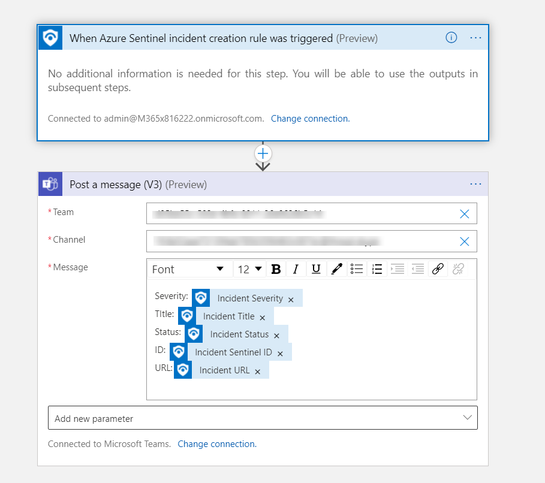
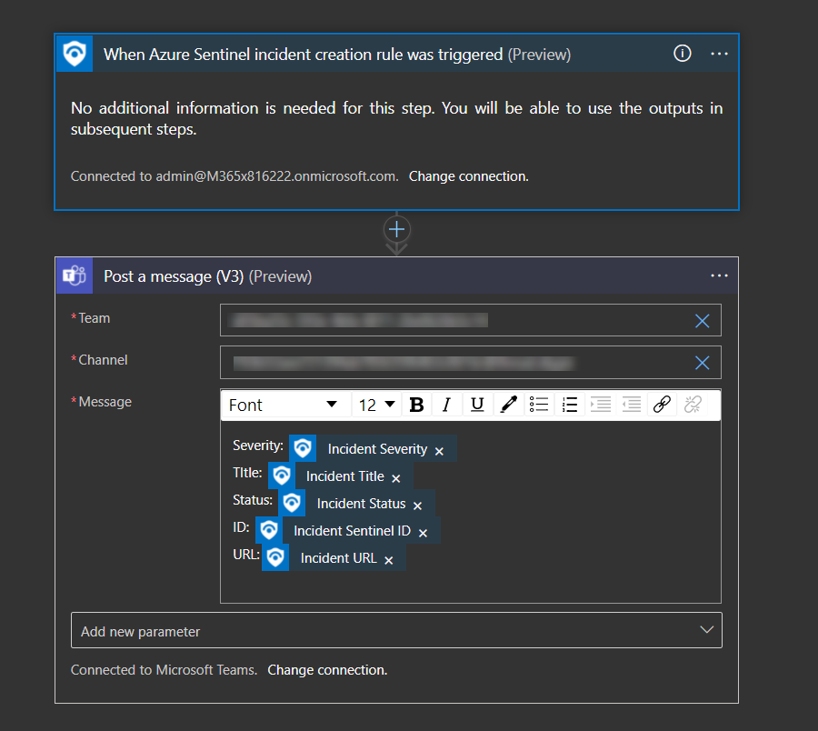
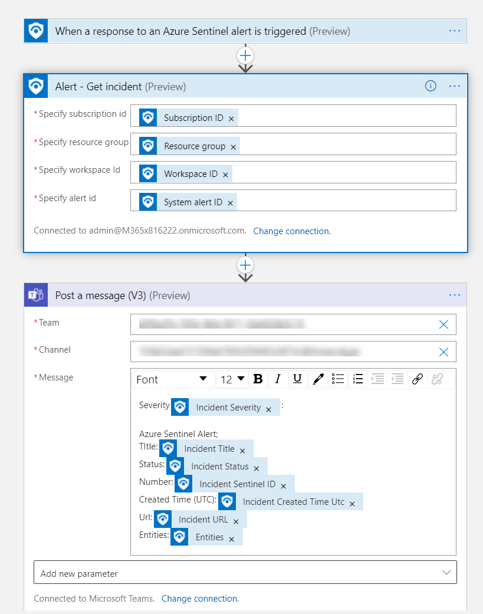
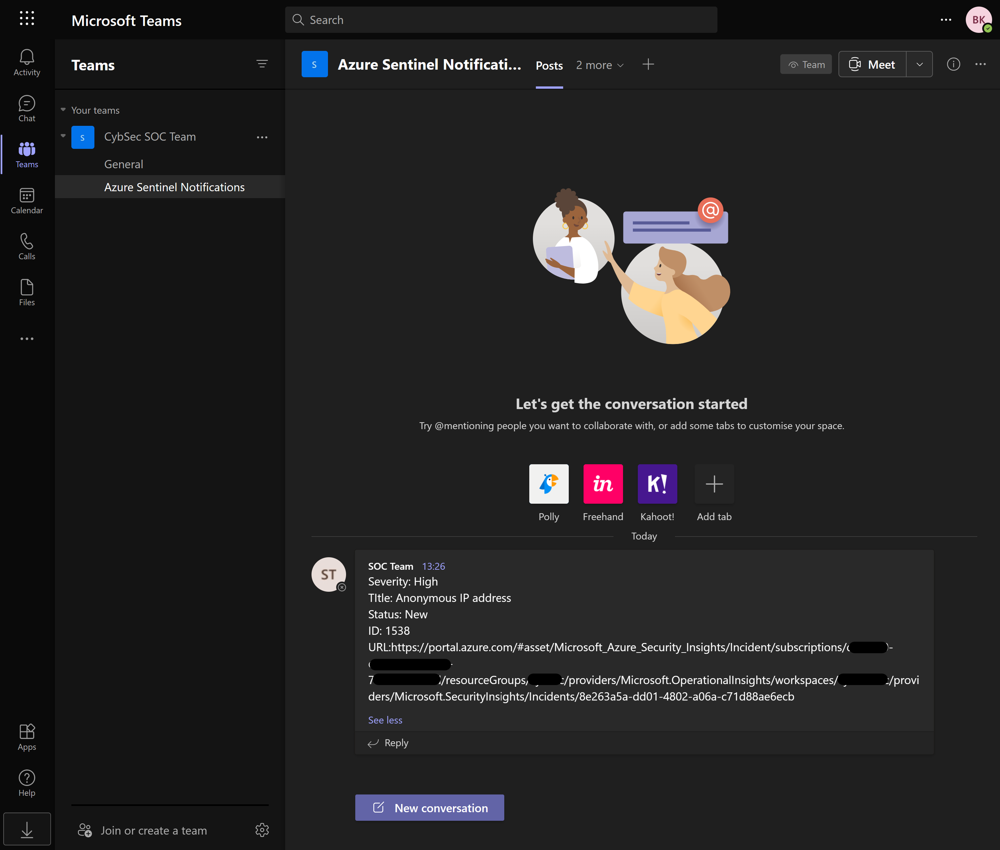

#  Post-Message-Teams

Author: Yaniv Shasha

This playbook will post a message in a Microsoft Teams channel when an Alert is created in Azure Sentinel

## Prerequisites

MS teams Account that allow to post messages

## Quick Deployment
**Deploy with incident trigger** (recommended)

After deployment, attach this playbook to an **automation rule** so it runs when the incident is created.

[Learn more about automation rules](https://docs.microsoft.com/azure/sentinel/automate-incident-handling-with-automation-rules#creating-and-managing-automation-rules)
 
 

**Deploy with alert trigger**

After deployment, you can run this playbook manually on an alert or attach it to an **analytics rule** so it will runs when an alert is created.

## Screenshots
**Incident Trigger**

**Alert Trigger**

**Microsoft Teams**

