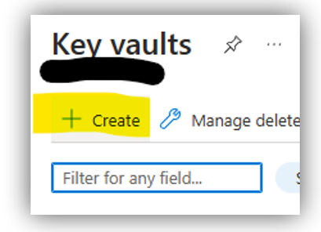
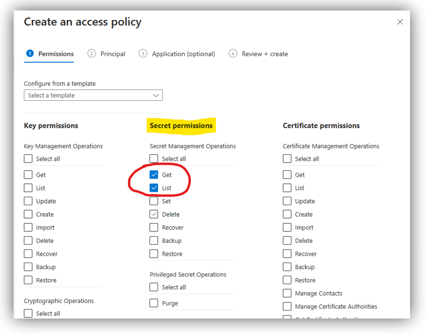
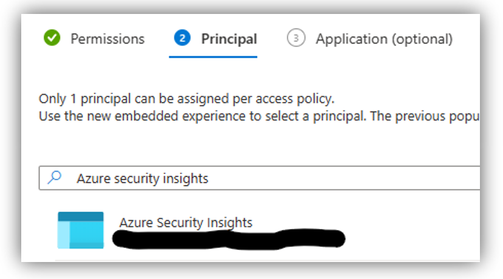

# Enrichment widgets

## Deploying

To deploy the enrichment widgets feature:

- First, [create a Key Vault to store the widgets configuration](#create-a-key-vault-to-store-widgets-credentials)
- Next, [configure the widgets you would like to use](#configure-widgets)

### Create a Key Vault to store widgets credentials

- Make sure you should have a Contributor Role over the Resource Group in which your Sentinel workspace is located.
- Start Azure Cloud Shell:
  - [Open cloud shell from the Azure Portal](https://learn.microsoft.com/azure/cloud-shell/quickstart?tabs=azurecli#start-cloud-shell)
  - [Select PowerShell as your shell environment](https://learn.microsoft.com/en-us/azure/cloud-shell/quickstart?tabs=azurecli#select-your-shell-environment)
- Use Azure Cloud Shell to copy the KeyVault provisioning script:

``` Command Line
Invoke-WebRequest -Uri https://aka.ms/SentinelWidgetsDeployScript -OutFile WidgetsKvCreation.Ps1
```

- Use Azure Cloud Shell to run the KeyVault provisioning script (See [Locating the workspace information](#locating-the-workspace-information) for information on how to get the Subscription ID and Workspace ID):

``` Command Line
./WidgetsKvCreation.Ps1 -SubscriptionId <subscription id> -WorkspaceId <workspace id>
```

- Make sure you record the KeyVault name that the script prints, as you will need it to configure the widgets. 

### Configure widgets

For each widget, configure the secrets and other parameters it requires using the links below, which will help you to store them in the workspace Key Vault.

#### Configure Anomali

- [Start the ARM template based configuration experience](https://aka.ms/SentinelWidgetsAnomaliARM) as shown below.
- Fill the subscription and resource group your of your Sentinel workspace. See [Locating the workspace information](#locating-the-workspace-information) for information on how to get those values.
- Enter the key vault name you recorded when [creating the the Key Vault](#create-a-key-vault-to-store-widgets-credentials). Refer to [Locating your Key Vault name](#locating-the-key-vault-name) if you did not record the name.
- Enter the username and API key defined in your Anomali account.
- Press on the “Review + create” button and deploy the template – this should add a secret named “AnomaliApiKey” to your key vault.


#### Configure Recorded future

- [Start the ARM template based configuration experience](https://aka.ms/SentinelWidgetsRecordedFutureARM) as shown below.
- Fill the subscription and resource group your of your Sentinel workspace. See [Locating the workspace information](#locating-the-workspace-information) for information on how to get those values.
- Enter the key vault name you recorded when [creating the the Key Vault](#create-a-key-vault-to-store-widgets-credentials). Refer to [Locating your Key Vault name](#locating-the-key-vault-name) if you did not record the name.
- Enter the API key defined in your Recoded future account.
- Press on the “Review + create” button and deploy the template – this should add a secret named “RecordedFuture” to your key vault.


## Using enrichment widgets

To start using widgets, join the Microsoft Security Private Preview program at [https://aka.ms/joinccp](https://aka.ms/joinccp). You will need to use the private preview feature flags to have the widgets available in your Sentinel environment.

### Viewing your widgets in the IP entity page

To view your widgets:

- Select your Sentinel workspace
- Press on the entity behavior menu option
- Your widgets should be available in the insights pane on the right side:


- If the source return no results, you will see a different display, for example:


### Viewing your widgets in the incident page

Similarly, you can view your enrichment widgets as part of an incident investigation. For an incidents that has an IP Address entity, select the entity and switch to the insights tab on the entity pane.  

## FAQ

### The widget configuration store has not been initialized

If you received in all widgets the message "The widget configuration store has not been initialized" as shown below, make sure that you followed the instructions in the section [Create a Key Vault to store widgets credentials](#create-a-key-vault-to-store-widgets-credentials) above. If you have done so, but still get the message, try [creating the required Key Vault manually](#manually-creating-the-key-vault).


### The widget has not been configured

If you received in a widget the message "The widget has not been configured as shown below, make sure that you followed the instruction in the section [Configuring widgets](#configure-widgets) above.


### Locating the workspace information

To get your Sentinel's Workspace ID, Resource Group and Subscription ID:

Go to the settings section in Sentinel:


Press on the workspace settings menu item:


Hover on the right side of each parameter to view its copy tool and copy it:


### Locating the Key Vault name

If you did not record the name, you can either [re-run the script](#create-a-key-vault-to-store-widgets-credentials), or search your Key Vaults in the  Azure Portal:

- Open the [Key Vaults list](https://ms.portal.azure.com/#view/HubsExtension/BrowseResource/resourceType/Microsoft.KeyVault%2Fvaults). 
- Search for Key Vaults whose name starts with "widgets-".
- Verify that the "widgets-..." Key Vault matches your workspace, by entering the 'Tags' page of the KeyVault, and checking that the **WorkspaceId** tag matches the Workspace ID of your Sentinel workspace.

### Manually creating the Key Vault

If you receive a message in your widgets that the widget configuration store has not been initialized as decribed [above](#the-widget-configuration-store-has-not-been-initialized) you can try to create the Key Vault manually:

1) Get the workspace ID, Resource Group and Subscription ID as described [here](#locating-the-workspace-information).

2) Run one of the following scripts (TBD: where to download and pre-requisites) and copy the key vault name to be used later:

``` Python
python CreateKVName.py –workspace-id <workspace-id>
```

``` PowerShell
./CreateKVName.PS1 -WorkspaceId <workspace-id>
```

3) Search for "Key Vault" in Azure global search and choose “Key vaults”:


 
4) Press on the “Create” button in the upper left corner.


 
5) Enter the Subscription Name and Resource group name of your Sentinel workspace in the relevant input fields.

6) Enter the Key Vault name you copied above in the "Key vault name" input field:


7) Make sure that the region field is set to the Workspace region.
 
8) Press next to move to the "Access configuration" tab, choose the “Vault access policy” radio button to mark yourself.

9) Press on the “Create” button to add Sentinel to the access policy.


 
10) In the right pane opened, select "Get" and "List" in the "Secret permissions" only:



11)	Press next to move to the "Principal" tab, and search for "Azure Security Insights", and select it. "Azure Security Insights" the internal name for Microsoft Sentinel. Sentinel needs these permissions to access the credentials stored in the key vault to perform the interaction with the 3rd party service provider:



12) Press "Next" twice and then "Create" to create the access policy. 

13) Press "Next" twice to get to the “Tags” tab add the workspace name and ID that this Key Vault is related to:


  
14)	Press on the “Review + create” to create the Key Vault.
